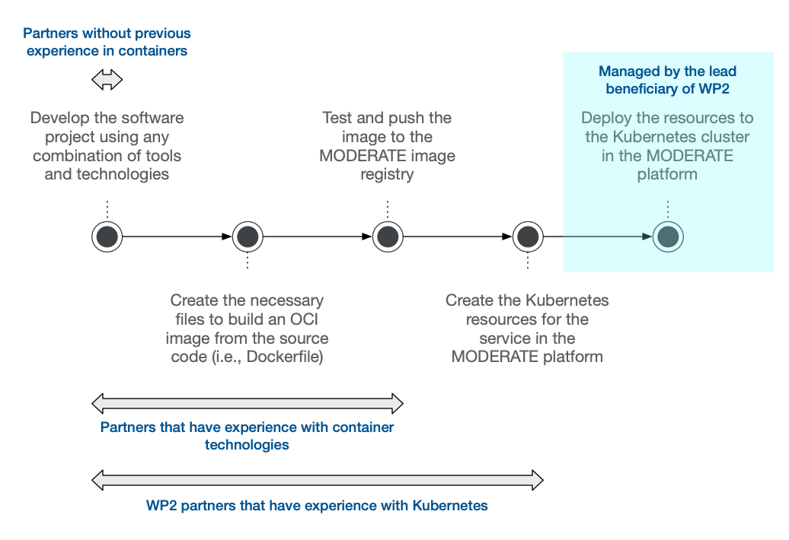

# Integrating New Services and Applications

This page provides a guide on how to integrate a new service or application into the platform. It is mainly aimed at developers who are working on a tool or web application and are wondering how they can go from their local development environment to having their services deployed in the Kubernetes cluster within the platform's cloud services.

In this integration process, there are two distinct actors:

* The **developer** of the web application or service: This developer possesses a deep understanding of their own code and has a clear vision of its requirements in terms of services, databases, and other components. However, they may not be familiar with the specific workings of the platform or the configuration of the Kubernetes cluster.
* The **administrator** of the platform: This actor perceives the application provided by the developer as a "black box" and possesses the knowledge required to deploy this application in a way that enables it to function alongside existing services (such as databases) and be accessible to end users of the platform.

The contact email for the platform administrator can be found in the [MODERATE Github organization](https://github.com/MODERATE-Project).

## Steps for Integration

The following diagram shows the steps of the development and integration process:



### 👩‍💻 Step 1: Development

**Who**: _Developer_

Development of the web application or service using whatever technology stack the developer prefers.

The credentials and configuration parameters for external services, such as databases, message queues, and object storage services, should be expected by the application as environment variables. These variables should be clearly documented in the repository's README file and would serve as the basis for the configuration of the application in the platform.

!!! warning "About configuration parameters"

    It is crucial to avoid hardcoding configuration parameters, such as database credentials and connection URIs, directly in the application or relying on manual updates in a configuration file once the application or service is deployed. Please use environment variables instead.

Although it is fine to start in a private repository, development should eventually be centralized in a repository within [MODERATE's GitHub organization](https://github.com/MODERATE-Project).

### 📦 Step 2: Dockerfile

**Who**: _Developer_

Write a [Dockerfile](https://docs.docker.com/develop/develop-images/dockerfile_best-practices/) and test that the containers work properly in a local environment.

For example, this is the [Dockerfile](https://github.com/MODERATE-Project/moderate-docs/blob/main/Dockerfile) used to build the `moderate-docs` image, which is the documentation website you are currently reading.

This Dockerfile should be contained in the repository of the application or service. It should be located in the root directory of the repository and named `Dockerfile`.

### 👷‍♂️ Step 3: Continuous Integration

**Who**: _Developer_ or _Administrator_

Create an [Action](https://github.com/features/actions) in the repository that builds the image on each push to the `main` branch and publishes it as a public package on the [GitHub Container Registry](https://docs.github.com/en/packages/working-with-a-github-packages-registry/working-with-the-container-registry), under `ghcr.io/moderate-project/`. Actions need to be located in a YAML file in the `.github/workflows` directory of the repository.

For example, the following is [the _Action workflow_ configuration file for this documentation website](https://github.com/MODERATE-Project/moderate-docs/blob/main/.github/workflows/docker-publish.yml). Please note the following details:

* The workflow configuration file for your own application should be mostly the same. **The only parameter that should change** is the image name at the end of `images` (`moderate-docs` in the example). This name needs to be unique across the entire MODERATE platform. If your Dockerfile lives in a subdirectory, also set `context` in the build step to that directory, and `file` if it is not named `Dockerfile`.
* You don't need to configure any secrets or variables. The workflow logs into the registry with the `GITHUB_TOKEN` that GitHub Actions creates for every run.
* Pushes to `main` publish the `main`, `latest` and `sha-<short-sha>` tags. A version tag such as `v1.2.3` publishes `1.2.3` and `sha-<short-sha>`. Pull requests to `main` build the image to check the Dockerfile but don't publish it.
* After the workflow publishes your first image, ask the administrator to make sure the package is public, so anyone can pull it without credentials.

```yaml title="Example of a workflow file to build and push an image to the GitHub Container Registry"
name: Build and push the Docker image to GitHub Container Registry (GHCR)

on:
  push:
    branches:
      - main
    tags:
      - "v*"
  pull_request:
    branches:
      - main
  workflow_dispatch:

env:
  REGISTRY: ghcr.io

jobs:
  build-and-push:
    runs-on: ubuntu-latest
    permissions:
      contents: read
      packages: write
    steps:
      - name: Checkout repository
        uses: actions/checkout@v5

      - name: Set up Docker Buildx
        uses: docker/setup-buildx-action@v4

      - name: Log into registry ${{ env.REGISTRY }}
        if: github.event_name != 'pull_request'
        uses: docker/login-action@v4
        with:
          registry: ${{ env.REGISTRY }}
          username: ${{ github.actor }}
          password: ${{ secrets.GITHUB_TOKEN }}

      - name: Extract Docker metadata
        id: meta
        uses: docker/metadata-action@v6
        with:
          images: ${{ env.REGISTRY }}/${{ github.repository_owner }}/moderate-docs
          # Keep "latest" pointing at the tip of main; the default "auto"
          # would also move it on every release tag push.
          flavor: latest=false
          tags: |
            type=ref,event=branch
            type=ref,event=pr
            type=semver,pattern={{version}}
            type=sha,prefix=sha-
            type=raw,value=latest,enable={{is_default_branch}}

      - name: Build and push Docker image
        uses: docker/build-push-action@v7
        with:
          context: .
          push: ${{ github.event_name != 'pull_request' }}
          tags: ${{ steps.meta.outputs.tags }}
          labels: ${{ steps.meta.outputs.labels }}
          cache-from: type=gha
          cache-to: type=gha,mode=max
          platforms: linux/amd64
```

### 🏗️ Step 4: Terraform Resources

**Who**: _Administrator_

Create the [Terraform resources](https://developer.hashicorp.com/terraform/intro) that define the Kubernetes resources, which, in turn, represent the deployment of the web application or service.

Once the application is defined as Terraform resources within the [moderate-infrastructure repository](https://github.com/MODERATE-Project/moderate-infrastructure), it can seamlessly integrate into the platform's life cycle. This enables deployment, destruction, and re-creation with minimal effort.

### ☁️ Step 5: Deployment

**Who**: _Administrator_

Deploy these Terraform resources to MODERATE's cloud platform.

## Frequently Asked Questions

### Am I restricted in the technology stack that I can use?

No. You can use any technology stack that you want. However, you should be aware that the administrator won't know the internal details of your application, and will thus be unable to help you with issues outside of integration with the platform and deployment.

### Are there any examples of applications or services that have already been integrated into the platform?

Sure! Take a look at the [`moderate-platform-api`](https://github.com/MODERATE-Project/moderate-platform-api) repository.

### What should I do to deploy the databases or other services that my application depends on?

The administrator will take care of deploying the databases and other services that your application depends on. You should simply **document the configuration parameters that your application expects to find in the environment variables**.

[You can get in touch with the administrator](https://github.com/MODERATE-Project) to discuss the requirements of your application and the best way to integrate it into the platform.

### Do I have to do something specific for my container to run on Kubernetes?

No. The containers that you build with your Dockerfile will run on Kubernetes without any modifications. The administrator will take care of creating the Kubernetes resources that will run your containers.

### Will new versions of my application be automatically deployed?

No for the time being. The administrator will take care of manually deploying new versions of your application. However, we will probably move to a Continuous Deployment model in the future.

### My application is offline. What should I do?

Please note that the cloud platform will be intermittently unavailable during the development phase. If you need to test your application for a continued period of time, please contact the administrator to ensure that the platform is available.