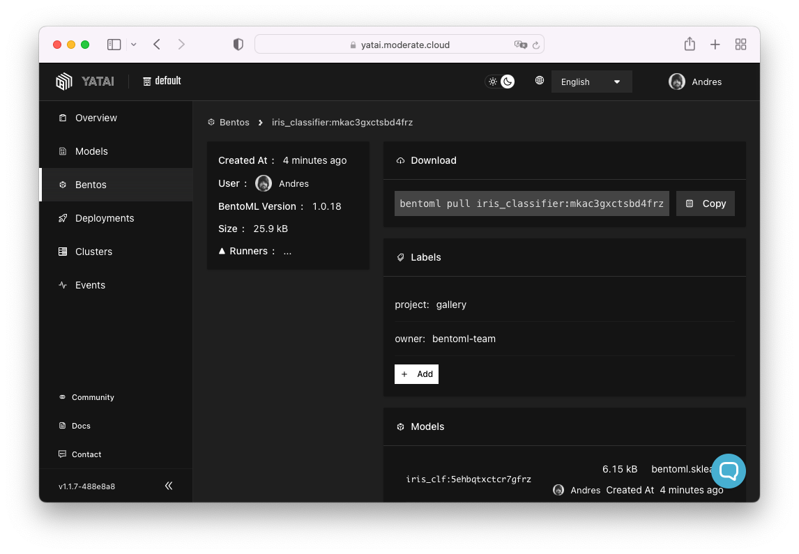
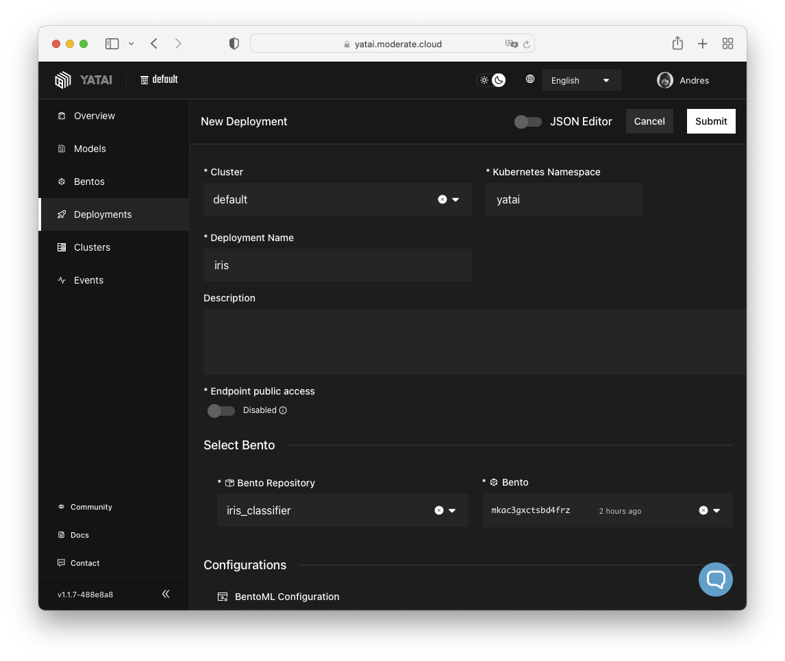

# Deploying ML Models

The MODERATE platform leverages [Yatai](https://github.com/bentoml/Yatai) to offer a scalable service for storing and exposing machine learning models created with [BentoML](https://www.bentoml.com/). This allows developers to utilize the MODERATE platform as a model repository, as well as a service that can automatically deploy HTTP APIs for said models.

This guide provides a concise example of how to upload and deploy a machine learning model on the platform from start to finish.

!!! info "About BentoML"

    Please check the [BentoML quickstart tutorial](https://docs.bentoml.org/en/latest/tutorial.html) for an introduction to the main concepts behind BentoML.

The first step is to clone the BentoML Git repository:

``` console
$ git clone --depth 1 --branch v1.0.18 git@github.com:bentoml/BentoML.git # (1)!
```

1. We clone a specific version for reproducibility. In any case, this guide should work for later versions.

Create a virtualenv and install the Python package requirements of the _quickstart_ example:

``` console
$ cd BentoML/examples/quickstart
$ virtualenv --python python3 .venv
$ source .venv/bin/activate
$ pip install -r requirements.txt
```

Train the model and [save it to the BentoML local model store](https://docs.bentoml.org/en/latest/concepts/model.html#save-a-trained-model):

``` console
$ python train.py
Model saved: Model(tag="iris_clf:5ehbqtxctcr7gfrz")
```

!!! warning "Ignore the virtualenv"

    Make sure to add `.venv` to the [`.bentoignore`](https://docs.bentoml.org/en/latest/concepts/bento.html#files-to-exclude) to avoid packing the entire virtualenv into the Bento.

``` title=".bentoignore" hl_lines="5"
__pycache__/
*.py[cod]
*$py.class
.ipynb_checkpoints
.venv
```

The `build` command creates the [Bento](https://docs.bentoml.org/en/latest/concepts/bento.html#what-is-a-bento): a self-contained package that contains all assets that are necessary to deploy the model:

``` console
$ bentoml build
Building BentoML service "iris_classifier:mkac3gxctsbd4frz" from build context "[...]/BentoML/examples/quickstart".
Packing model "iris_clf:5ehbqtxctcr7gfrz"
Locking PyPI package versions.

██████╗░███████╗███╗░░██╗████████╗░█████╗░███╗░░░███╗██╗░░░░░
██╔══██╗██╔════╝████╗░██║╚══██╔══╝██╔══██╗████╗░████║██║░░░░░
██████╦╝█████╗░░██╔██╗██║░░░██║░░░██║░░██║██╔████╔██║██║░░░░░
██╔══██╗██╔══╝░░██║╚████║░░░██║░░░██║░░██║██║╚██╔╝██║██║░░░░░
██████╦╝███████╗██║░╚███║░░░██║░░░╚█████╔╝██║░╚═╝░██║███████╗
╚═════╝░╚══════╝╚═╝░░╚══╝░░░╚═╝░░░░╚════╝░╚═╝░░░░░╚═╝╚══════╝

Successfully built Bento(tag="iris_classifier:mkac3gxctsbd4frz").

Possible next steps:

 * Containerize your Bento with `bentoml containerize`:
    $ bentoml containerize iris_classifier:mkac3gxctsbd4frz

 * Push to BentoCloud with `bentoml push`:
    $ bentoml push iris_classifier:mkac3gxctsbd4frz
```

The `list` command provides a list of the local Bentos:

``` console
$ bentoml list
 Tag                               Size       Creation Time        Path
 iris_classifier:mkac3gxctsbd4frz  25.34 KiB  2023-04-24 14:34:46  ~/bentoml/bentos/iris_classifier/mkac3gxctsbd4frz
```

After the Bento is added to the system, it can be deployed to MODERATE's Yatai instance. To do this, first, you will need to log in using the API token provided by the platform administrator:

``` console
$ bentoml yatai login --api-token <token> --endpoint https://yatai.moderate.cloud
Overriding existing Yatai context config: default
Successfully logged in as user "User" in organization "default".
``` 

Yatai serves as a storage platform for Bentos and Models, much like how an image registry functions for container images. To upload a Bento to the Yatai instance, simply use the `push` command to transfer it from the system:

``` console
$ bentoml push iris_classifier:mkac3gxctsbd4frz
╭─────────────────────────────────────────────────────────────────────────────────────────────────────────────────────────────────────────────────────────────────────────────────────────────────────────────────╮
│ Successfully pushed model "iris_clf:5ehbqtxctcr7gfrz"                                                                                                                                                           │
│ Successfully pushed bento "iris_classifier:mkac3gxctsbd4frz"                                                                                                                                                    │
╰─────────────────────────────────────────────────────────────────────────────────────────────────────────────────────────────────────────────────────────────────────────────────────────────────────────────────╯
Pushing Bento "iris_classifier:mkac3gxctsbd4frz" ━━━━━━━━━━━━━━━━━━━━━━━━━━━━━━━━━━━━━━━━━━━━━━━━━━━━━━━━━━━━━━━━━━━━━━━━━━━━━━━━━━━━━━━━━━━━━━━━━━━━━━━━━━━━━━━━━━━━━━━━━━━━━━━━ 100.0% • 7.2/7.2 kB • ? • 0:00:00
     Uploading model "iris_clf:5ehbqtxctcr7gfrz" ━━━━━━━━━━━━━━━━━━━━━━━━━━━━━━━━━━━━━━━━━━━━━━━━━━━━━━━━━━━━━━━━━━━━━━━━━━━━━━━━━━━━━━━━━━━━━━━━━━━━━━━━━━━━━━━━━━━━━━━━━━━━━━━━ 100.0% • 2.1/2.1 kB • ? • 0:00:00
```

Once you have successfully uploaded a Bento to Yatai, it will be displayed in the _Bentos_ section of the dashboard:



!!! tip "Number of replicas"

    In the following example both `min_replicas` and `max_replicas` are set to `1` for development purposes. In a production environment it would be better for `max_replicas` to be `2` or `3` to provide some availability guarantees.

!!! tip "Resource requests"

    Please reduce the resource requests of the Service and [Runner](https://docs.bentoml.org/en/latest/concepts/runner.html) replicas if possible. These values can be defined in `targets.*.config.resources.requests` and `targets.*.config.runners.*.resources.requests` respectively.

!!! warning "Endpoint public access"

    Note that if you activate _Endpoint public access_ in the Deployment form, the HTTP API will be exposed to the Internet without authentication. This is the equivalent of setting `enable_ingress` to `true` in the JSON document.

To make the ML model's HTTP API accessible, the final step is to create a deployment via the Yatai dashboard. This action generates the necessary Kubernetes resources.

Creating a deployment is straightforward using the visual form in the Yatai dashboard. It's generally easier than manually creating the [`BentoDeployment`](https://docs.bentoml.org/projects/yatai/en/latest/concepts/bentodeployment_crd.html) Kubernetes resources:



``` json title="JSON document that describes the Deployment shown in the screenshot"
{
    "cluster_name": "default",
    "name": "iris",
    "description": "",
    "targets": [
        {
            "type": "stable",
            "bento_repository": "iris_classifier",
            "bento": "mkac3gxctsbd4frz",
            "config": {
                "hpa_conf": {
                    "min_replicas": 1,
                    "max_replicas": 1
                },
                "resources": {
                    "requests": {
                        "cpu": "50m",
                        "memory": "500Mi",
                        "gpu": ""
                    },
                    "limits": {
                        "cpu": "1000m",
                        "memory": "1024Mi",
                        "gpu": ""
                    }
                },
                "envs": [],
                "runners": {
                    "iris_clf": {
                        "resources": {
                            "requests": {
                                "cpu": "50m",
                                "memory": "500Mi",
                                "gpu": ""
                            },
                            "limits": {
                                "cpu": "1000m",
                                "memory": "1024Mi",
                                "gpu": ""
                            }
                        },
                        "hpa_conf": {
                            "min_replicas": 1,
                            "max_replicas": 1
                        },
                        "deployment_strategy": "RollingUpdate"
                    }
                },
                "enable_ingress": false,
                "deployment_strategy": "RollingUpdate"
            }
        }
    ],
    "kube_namespace": "yatai"
}
```