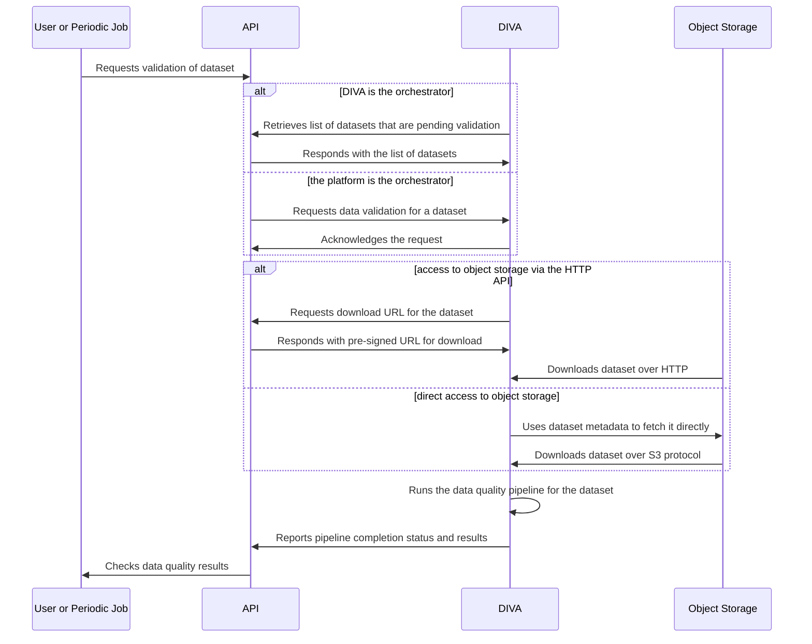

# Integration of the DIVA

The Data Integrity and Validation Architecture (DIVA) is one of the main building blocks of the MODERATE platform. It is responsible for the validation and quality analysis of the datasets that are ingested into the platform.

This document outlines a possible approach to how the DIVA retrieves datasets from the MODERATE platform to run its data quality pipelines. The main components involved in this workflow include:

* The **DIVA** itself, which retrieves datasets for validation and quality analysis.
* The **object storage service**, where the datasets are stored. This service is implemented on top of Google Cloud Storage (GCS), with MODERATE prioritizing the use of the S3-compatible API for GCS to ensure interoperability.
* The **platform HTTP API**, serving as the main entry point for DIVA to interact with the MODERATE platform. It exposes the catalogue of datasets, allowing the DIVA to list and retrieve the metadata of the datasets that are available for validation.

The details of the API can be reviewed in its interactive API documentation, which is based on OpenAPI and is [automatically generated by FastAPI](https://fastapi.tiangolo.com/tutorial/first-steps/#interactive-api-docs). You can deploy the API documentation locally by following these instructions:

> You need Docker to run the development stack.

1. Clone the repository [MODERATE-Project/moderate-platform-api](https://github.com/MODERATE-Project/moderate-platform-api)
2. Run the task to deploy the development stack: `task dev-up`
3. Access the API documentation at [http://localhost:8000/docs](http://localhost:8000/docs)
4. Once you are done, you can stop the development stack by running `task dev-down`

> Don't worry if the task complains about not being able to pull the image for the Trust Services. The API documentation will work anyway.

The following sequence diagram shows a high-level view of how the DIVA could interact with the MODERATE platform to retrieve datasets and orchestrate the data quality pipelines:

Some key points to consider:

* The HTTP API endpoints that the DIVA would use to retrieve the list of datasets and report pipeline results are not yet available. They would be implemented if the MODERATE team decides to adopt this approach.
* There are two possible alternatives for downloading datasets, depending on what is more convenient for the DIVA:
    * Access to the object storage via the HTTP API, which provides pre-signed URLs for downloading the datasets.
    * Direct access to the object storage service, using the dataset metadata to fetch the datasets directly over the S3 protocol.
* There are also two possible alternatives for triggering the data quality pipeline: either DIVA periodically checks the API, or the platform pushes requests to DIVA, which then executes the pipelines on demand.
* Data quality pipeline runs could be either requested manually by end users via the MODERATE platform web UI or triggered by periodic jobs scheduled to run at specific intervals.
