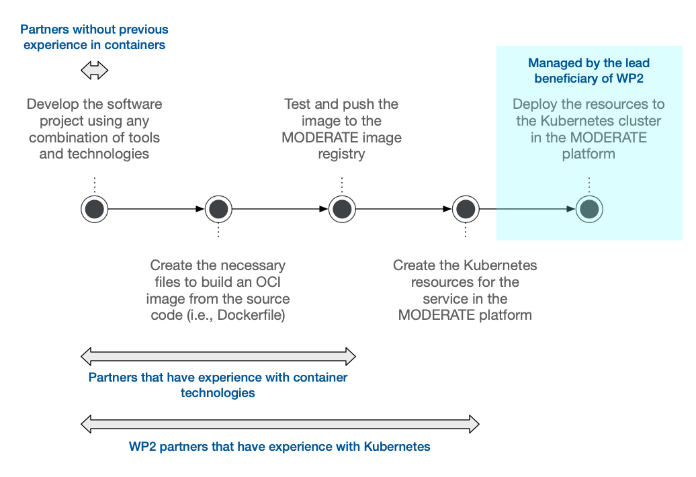

# Integrating New Services and Applications

This page provides a guide on how to integrate a new service or application into the platform. It is mainly aimed at developers who are working on a tool or web application and are wondering how they can go from their local development environment to having their services deployed in the Kubernetes cluster within the platform's cloud services.

In this integration process, there are two distinct actors:

* The **developer** of the web application or service: This developer possesses a deep understanding of their own code and has a clear vision of its requirements in terms of services, databases, and other components. However, they may not be familiar with the specific workings of the platform or the configuration of the Kubernetes cluster.
* The **administrator** of the platform: This actor perceives the application provided by the developer as a "black box" and possesses the knowledge required to deploy this application in a way that enables it to function alongside existing services (such as databases) and be accessible to end users of the platform.

The contact email for the platform administrator can be found in the [MODERATE Github organization](https://github.com/MODERATE-Project).

## Steps for Integration

The following diagram shows the steps of the development and integration process:



### 👩‍💻 Step 1: Development

**Who**: _Developer_

Development of the web application or service using whatever technology stack the developer prefers.

The credentials and configuration parameters for external services, such as databases, message queues, and object storage services, should be expected by the application as environment variables. These variables should be clearly documented in the repository's README file and would serve as the basis for the configuration of the application in the platform.

!!! warning "About configuration parameters"

    It is crucial to avoid hardcoding configuration parameters, such as database credentials and connection URIs, directly in the application or relying on manual updates in a configuration file once the application or service is deployed. Please use environment variables instead.

Although it is fine to start in a private repository, development should eventually be centralized in a repository within [MODERATE's GitHub organization](https://github.com/MODERATE-Project).

### 📦 Step 2: Dockerfile

**Who**: _Developer_

Write a [Dockerfile](https://docs.docker.com/develop/develop-images/dockerfile_best-practices/) and test that the containers work properly in a local environment.

For example, this is the [Dockerfile](https://github.com/MODERATE-Project/moderate-docs/blob/main/Dockerfile) used to build the `moderate-docs` image, which is the documentation website you are currently reading.

### 👷‍♂️ Step 3: Continuous Integration

**Who**: _Developer_ or _Administrator_

Create an [Action](https://github.com/features/actions) in the repository for the images to be built on each push to the `main` branch and then uploaded to MODERATE's image registry. Actions need to be located in a YAML file in the `.github/workflows` directory of the repository.

For example, the following is [the _Action workflow_ configuration file for the MODERATE HTTP API](https://github.com/MODERATE-Project/moderate-platform-api/blob/main/.github/workflows/build-push-gar.yml). Please note the following details:

* The workflow configuration file for your own application should be mostly the same. **The only parameter that should change** is the `image_name`, which is the name of the image in the image registry. This name needs to be unique across the entire MODERATE platform.
* We simply reuse [an existing configuration file](https://github.com/MODERATE-Project/moderate-docs/blob/main/.github/workflows/reusable-build-push-gar.yml) that is already present in the `moderate-docs` repository.
* All the variables and secrets (e.g. `secrets.WIF_PROVIDER`) have already been configured at the organization level by the administrator. Note that the administrator needs to manually enable the secrets for a particular repository before they are available.

```yaml title="Example of a workflow file to build and push an image to MODERATE's image registry"
name: Build and push an image to Google Artifact Registry (GAR)

on:
  push:
    branches:
      - main

jobs:
  call-build-push-artifact-registry:
    uses: MODERATE-Project/moderate-docs/.github/workflows/reusable-build-push-gar.yml@main
    with:
      project_id: ${{ vars.DEFAULT_GAR_PROJECT_ID }}
      gar_location: ${{ vars.DEFAULT_GAR_LOCATION }}
      gar_repo: ${{ vars.DEFAULT_GAR_REPOSITORY }}
      image_name: moderate-api
    secrets:
      wif_provider: ${{ secrets.WIF_PROVIDER }}
      wif_service_account: ${{ secrets.WIF_SERVICE_ACCOUNT }}
```

### 🏗️ Step 4: Terraform Resources

**Who**: _Administrator_

Create the [Terraform resources](https://github.com/MODERATE-Project/moderate-infrastructure) that define the Kubernetes resources, which, in turn, represent the deployment of the web application or service.

Once the application is defined as Terraform resources within the [moderate-infrastructure repository](https://github.com/MODERATE-Project/moderate-infrastructure), it can seamlessly integrate into the platform's life cycle. This enables effortless deployment, destruction, and re-creation with minimal effort.

### ☁️ Step 5: Deployment

**Who**: _Administrator_

Deploy these Terraform resources to MODERATE's cloud platform.