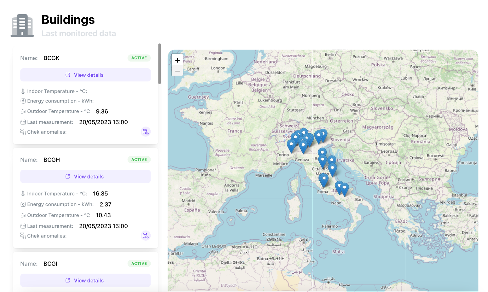

# Contextual Anomaly Detector Tool

!!! abstract "Abstract"

    The benchmarking tool is designed to visualize, compare, and analyze the performance of buildings using specific Key Performance Indicators (KPIs). This tool evaluates various types of data, from tabular data like Energy Performance Certificates to time-series data directly monitored in the building, considering not only energy consumption but also comfort conditions.
    With correct data normalization, an energy manager can assess building trends using simple graphs and identify potential improvement actions, reducing consumption and/or enhancing comfort conditions. Additionally, the tool can provide insights into energy efficiency measures and their impact on operational costs, allowing for more informed decision-making and strategic planning. 

## Introduction

In an era where energy efficiency and sustainability are key priorities, understanding how a building performs compared to industry benchmarks is essential. The Building Benchmarking Tool is a web-based platform that enables users to analyze and compare the energy performance of buildings.
By leveraging a comprehensive database of reference buildings, the tool provides insights into energy consumption, indoor comfort, and efficiency levels, helping professionals make data-driven decisions. Through interactive visualizations and customizable inputs, users can assess their building’s energy footprint, identify potential inefficiencies, and explore strategies for optimization. Additionally, the tool considers climate zone variations, ensuring that benchmarks are accurate and region-specific.
Whether you are an energy manager,  energy consultant, or building owner, this tool serves as a valuable resource for improving sustainability and reducing operational costs
A new section has been integrated into the tool that includes the evaluation of possible sensor malfunctions or anomalies. This part represents a preliminary assessment of the integration of moderate applications such as fault detection.

<figure markdown="span">
  { width="800" }
  <figcaption>Benchmarking multiple buildings</figcaption>
</figure>

## User Guide
The tool is composed of five main sections, accessible through the navbar in the header. These sections include four main categories:
### Building
Users can view all managed buildings, including the latest sensor readings and the ability to view comfort performances and anomalies for a selected building.

<figure markdown="span">
  { width="800" }
  <figcaption>List of all buildings</figcaption>
</figure>

### Processing
In this section, users can connect processed and cleaned time-series data for a specific building sensor from a CSV format to the database where the measured data is stored. Moreover, using the Python library Brickllm, users can update building metadata. These metadata are saved in RDF format and generated following the brickschema ontology. The Brickllm library allows the regeneration of the building description file, updating, for example, the identifier value for the new connected sensor. For its use, an API key for a specific LLM provider (ChatGPT, Fireworks, or Anthropic) is required.

### Benchmarking
In this section, users can visualize the performances of all buildings through specific KPIs. Additionally, users can compare these buildings with each other or select two for comparison.

<figure markdown="span">
  { width="800" }
  <figcaption>Comparison of buildings performances</figcaption>
</figure>

### Analysis
This section allows data analysis according to three main subsections:
- **Comfort**: Users can view internal temperature trends, assess periods of overheating and overcooling, and evaluate a regression model between internal and external temperatures. This assessment helps identify potential issues related to the building's system or envelope.

<figure markdown="span">
  { width="800" }
  <figcaption>Comfort analysis</figcaption>
</figure>

- **Energy**: Users can evaluate energy consumption performances, even linking to an average energy cost per kWh defined by the user. In this section, typical profiles during workdays, weekends, or weekly profiles can also be viewed.

<figure markdown="span">
  { width="800" }
  <figcaption>Monthly energy cost </figcaption>
</figure>

<figure markdown="span">
  { width="800" }
  <figcaption>Regression analysis energy vs Degree Days </figcaption>
</figure>

- **Anomalies**: Possible anomalies in the dataset for different sensors are identified. Each anomaly can be directly visualized in a graph.

<figure markdown="span">
  { width="800" }
  <figcaption>Identified anomalies </figcaption>
</figure>

