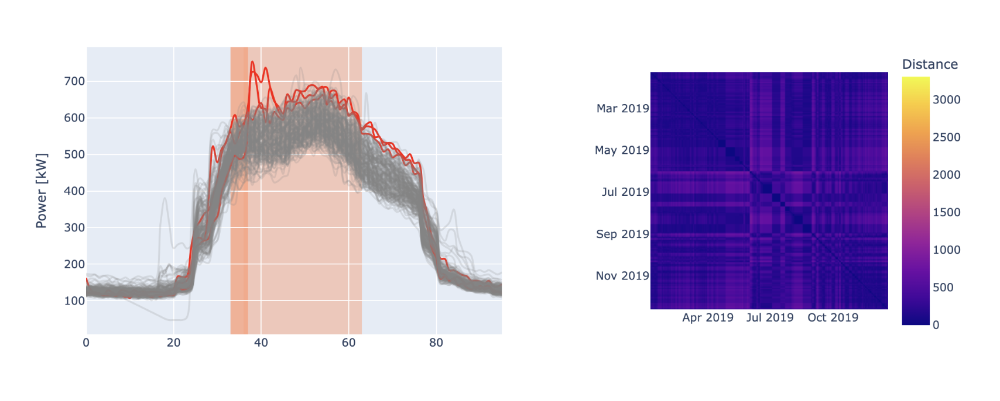

# CMP Anomaly Detection Tool

!!! abstract "Abstract"

    The "CMP Anomaly Detection Tool" is designed to identify anomalies in energy consumption at the meter level, leveraging both supervised and unsupervised analytics techniques along with the distance-based contextual matrix profile (CMP) algorithm. This tool autonomously detects infrequent subsequences in energy consumption timeseries, taking into account specific boundary conditions, and ranks anomalies based on a severity score that reflects the shape and magnitude of electrical load patterns. With self-tuning capabilities, it enables energy and facility managers to quickly recognize abnormal and non-optimal energy performance patterns, thereby supporting better decision-making to reduce inefficiencies and energy waste. 

## Introduction

Recently, the spread of IoT technologies has led to an unprecedented acquisition of energy-related data providing
accessible knowledge of the actual performance of buildings during their operation. A proper analysis of such data
supports energy and facility managers in spotting valuable energy saving opportunities. In this context, anomaly
detection and diagnosis (ADD) tools allow a prompt and automatic recognition of abnormal and non-optimal energy
performance patterns enabling a better decision-making to reduce energy wastes and system inefficiencies.

In this context, the "CMP Anomaly Detection Tool" was developed to identify energy consumption anomalies at meter-level.
The process leverages supervised and unsupervised
analytics techniques coupled with the distance-based contextual matrix profile (CMP) algorithm to discover infrequent
subsequences in energy consumption timeseries considering specific boundary conditions. The proposed process has
self-tuning capabilities and can rank anomalies according to severity score calculated with reference to shape and
magnitude of electrical load subsequences.

The tool has been employed in a real-world scenario to detect anomalies in the energy consumption of a university
campus, and it is a valuable tool for energy and facility managers to spot unexpected behaviour, producing an
interactive report as output.

## User Guide

TODO ask what will be the UI

This section explains how the tool or service is used from an end-user perspective. What should the user take into
account when running the tool? Are there any prerequisites, such as dependency installation or registration? If the tool
requires datasets as input, specify the requirements for these datasets, including the expected data format, column
types, and any other relevant details.

<figure markdown="span">
  { width="800" }
  <figcaption>Including images is always a good idea</figcaption>
</figure>

!!! info "Known limitations and issues"

    Be sure to mention any known limitations of the tool or service (if applicable), as well as any issues that are known and will be addressed in the future.

## References

Useful links and additional references.

