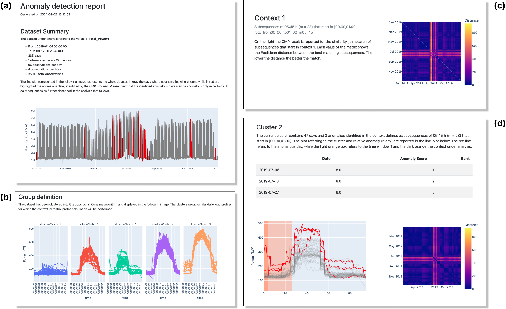

# Contextual Anomaly Detector Tool

!!! abstract "Abstract"

    The "Contextual anomaly detector tool" is designed to identify anomalies in energy consumption at the meter level, leveraging both supervised and unsupervised analytics techniques along with the distance-based contextual matrix profile (CMP) algorithm. This tool autonomously detects infrequent subsequences in energy consumption timeseries, taking into account specific boundary conditions, and ranks anomalies based on a severity score that reflects the shape and magnitude of electrical load patterns. With self-tuning capabilities, it enables energy and facility managers to quickly recognize abnormal and non-optimal energy performance patterns, thereby supporting better decision-making to reduce inefficiencies and energy waste. 

## Introduction

Recently, the spread of IoT technologies has led to an unprecedented acquisition of energy-related data providing
accessible knowledge of the actual performance of buildings during their operation. A proper analysis of such data
supports energy and facility managers in spotting valuable energy saving opportunities. In this context, anomaly
detection and diagnosis (ADD) tools allow a prompt and automatic recognition of abnormal and non-optimal energy
performance patterns enabling a better decision-making to reduce energy wastes and system inefficiencies.

In this context, the "Contextual anomaly detector tool" was developed to identify energy consumption anomalies at meter-level.
The process leverages supervised and unsupervised
analytics techniques coupled with the distance-based contextual matrix profile (CMP) algorithm to discover infrequent
subsequences in energy consumption timeseries considering specific boundary conditions. The proposed process has
self-tuning capabilities and can rank anomalies according to severity score calculated with reference to shape and
magnitude of electrical load subsequences.

The tool has been employed in a real-world scenario to detect anomalies in the energy consumption of a university
campus, and it is a valuable tool for energy and facility managers to spot unexpected behaviour, producing an
interactive report as output.

<figure markdown="span">
  { width="800" }
  <figcaption>Result of daily load profiles anomaly detection</figcaption>
</figure>

## Usage

The tool comes with a CLI that helps you to execute the script with the desired commands

```console 
$ python -m src.cmp.main -h

Matrix profile

positional arguments:
  input_file     Path to file
  variable_name  Variable name
  output_file    Path to the output file

options:
  -h, --help     show this help message and exit
```

The arguments to pass to the script are the following:

* `input_file`: The input dataset via an HTTP URL. The tool should then download the dataset from that URL; since it's a
  pre-signed URL, the tool would not need to deal with authentication—it can just download the dataset directly.
* `variable_name`: The variable name to be used for the analysis (i.e., the column of the csv that contains the
  electrical load under analysis).
* `output_file`: The local path to the output HTML report. The platform would then get that HTML report and upload it to
  the object
  storage service for the user to review later.

You can run the main script through the console using either local files or download data from an external url. This
repository comes with a sample dataset that you can use to generate a report and
you can pass the local path
as `input_file` argument.

### Data format

The tool requires the user to provide a csv file as input that contains electrical power timeseries for a specific
building, meter or energy system (e.g., whole building electrical power timeseries). The `csv` is a wide table format as
follows:

```csv
timestamp,column_1,temp
2019-01-01 00:00:00,116.4,-0.6
2019-01-01 00:15:00,125.6,-0.9
2019-01-01 00:30:00,119.2,-1.2
```

The csv must have the following columns:

- `timestamp` [case sensitive]: The timestamp of the observation in the format `YYYY-MM-DD HH:MM:SS`. This column is
  supposed to be in
  UTC timezone string format. It will be internally transformed by the tool into the index of the dataframe.
- `temp` [case sensitive]: Contains the external air temperature in Celsius degrees. This column is required to perform
  thermal sensitive
  analysis on the electrical load.
- `column_1`: Then the dataframe may have `N` arbitrary columns that refers to electrical load time series. The user has
  to specify the column name that refers to the electrical load time series in the `variable_name` argument.

### Run 

Now you can run the script from the console by passing the desired arguments. In the following we pass the sample
dataset [`data.csv`](src/cmp/data/data.csv) as input file and the variable `Total_Power` as the variable name to be used
for the analysis. The output file will be saved in the [`results`](src/cmp/results) folder.

```console
$ python -m src.cmp.main src/cmp/data/data.csv Total_Power src/cmp/results/reports/report.html

2024-08-13 12:45:42,821 [INFO](src.cmp.utils) ⬇️ Downloading file from <src/cmp/data/data.csv>
2024-08-13 12:45:43,070 [INFO](src.cmp.utils) 📊 Data processed successfully

*********************
CONTEXT 1 : Subsequences of 05:45 h (m = 23) that start in [00:00,01:00) (ctx_from00_00_to01_00_m05_45)
99.997%        0.0 sec

- Cluster 1 (1.660 s)   -> 1 anomalies
- Cluster 2 (0.372 s)   -> 3 anomalies
- Cluster 3 (0.389 s)   -> 4 anomalies
- Cluster 4 (0.593 s)   -> 5 anomalies
- Cluster 5 (-)         -> no anomalies green

[...]

2024-08-13 12:46:27,187 [INFO](__main__) TOTAL 0 min 44 s
2024-08-13 12:46:32,349 [INFO](src.cmp.utils) 🎉 Report generated successfully on src/cmp/results/reports/report.html

```

At the end of the execution you can download the report ad HTML file format.

## Result structure and interpretation

The results were organized in the final report into different sections as shown in Figure below. The
report section (a) was conceived as a summary of the results of the overall analysis.
In this part, the main characteristics of the input time series are calculated and displayed in a bullet point (e.g.,
number of observations) and the entire time series is represented in an interactive line plot where the anomalous
sub-sequences identified by the algorithm are highlighted in a red scale according to the severity level, ranging in the
interval from 6 to 8. The line plot can be navigated by the user and it
is possible to zoom onto a specific area of the time-series allowing the detailed exploration of the load profiles.

<figure markdown="span">
  { width="800" }
  <figcaption>Structure of the interactive report resulting from the contextual anomaly detector tool.</figcaption>
</figure>

As the report progresses, section (b) presents the cluster analysis results,
highlighting the grouping of daily load profiles and identifying time windows along with their context definitions.
Next, the analysis results are shown by context and group. For each context, the overall contextual matrix profile is
displayed, accompanied by a brief context overview (c). Then, for each
group, the group-specific contextual matrix profile is provided, along with a representation of the group's daily load
profiles (d). On the left, both the context and sub-daily time window are
visualized in dark orange and light orange, respectively. The daily load profiles for the group are shown in gray, while
those identified as anomalous for the specific context and time window are highlighted in red. This visual
representation is supported by a table listing the dates of the identified anomalies and their corresponding anomaly
scores.

!!! info "Known limitations and issues"

    A known limitation is the static generation of clusters and time windows that will be generalized and will be performed automatically based on the data provided. Moreover the delivery of the informative output will be enhanced.

## References

You can cite this work by using the following plain text citation

> Chiosa, Roberto, et al. "Towards a self-tuned data analytics-based process for an automatic context-aware detection
> and
> diagnosis of anomalies in building energy consumption timeseries." Energy and Buildings 270 (2022): 112302.

Other references

- [Published Paper](https://www.sciencedirect.com/science/article/abs/pii/S037877882200473X?via%3Dihub)
- [Contextual Anomaly Detector repository](https://github.com/baeda-polito/contextual-anomaly-detector/)
- [Series Distance Matrix repository](https://github.com/predict-idlab/seriesdistancematrix)
- [Stumpy Package](https://stumpy.readthedocs.io/en/latest/)


