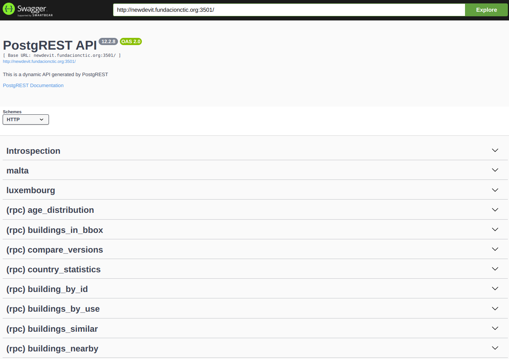
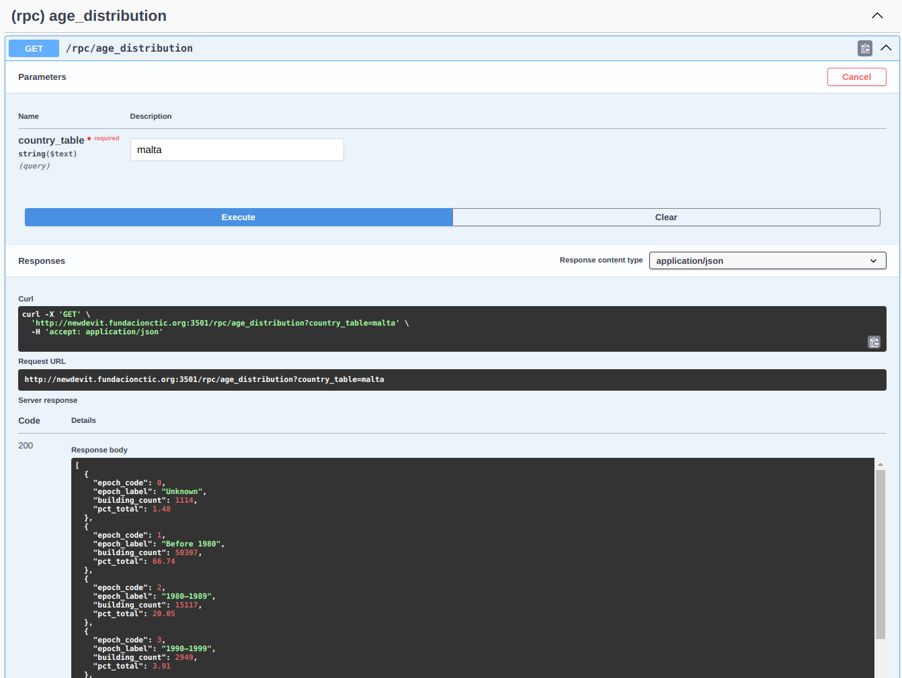
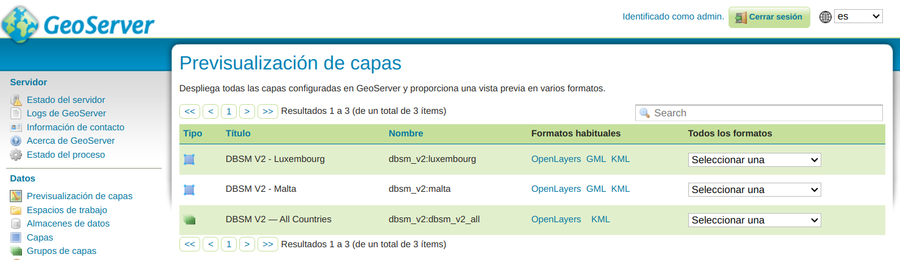
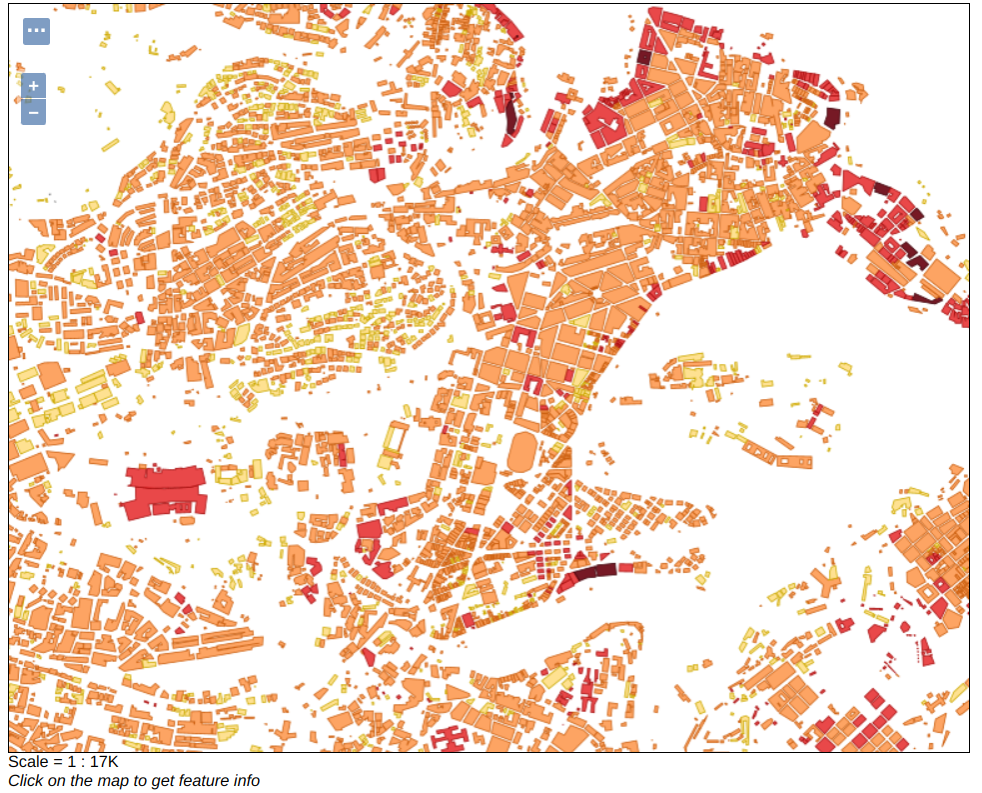
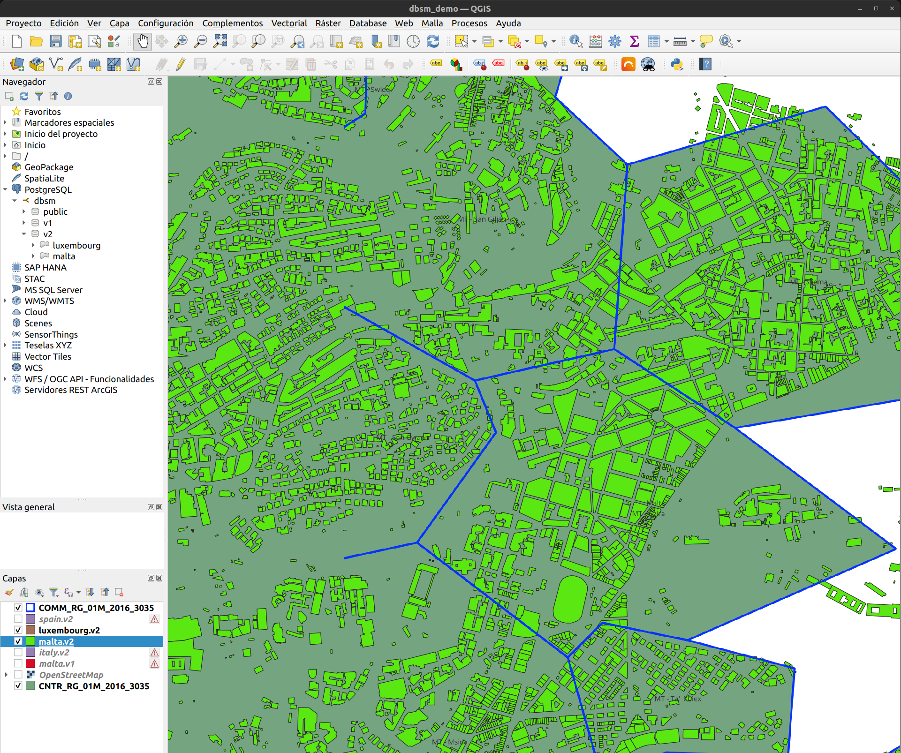
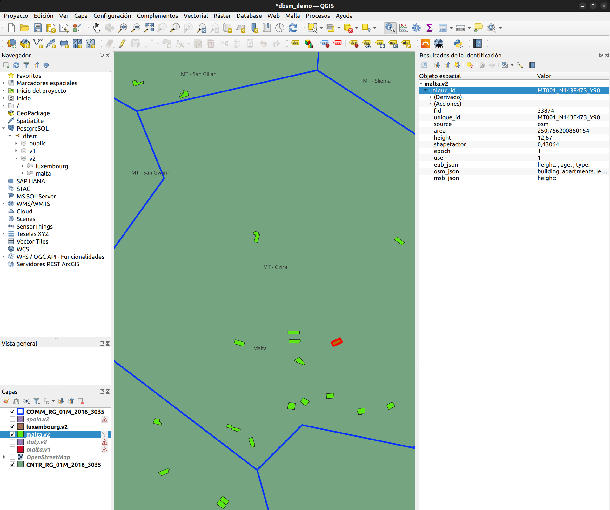

# DBSM R2025 GeoService

The DBSM GeoService is a containerized geospatial microservice stack for managing,
publishing, and querying the **Database of Structures and Buildings Mapping (DBSM)** —
a pan-European building footprint dataset covering 28 countries in two versions:
R2023 (v1) and R2025 (v2). The stack exposes a REST API, an OGC-compliant map service
via GeoServer, and a Swagger UI for interactive exploration. A ready-to-open QGIS
project is also provided for desktop-based spatial analysis.

## Introduction

The DBSM is a harmonised European dataset of building footprints, aggregating data from
EuroBuildings, OpenStreetMap, and Microsoft Buildings. For each country, the dataset
provides building geometries alongside attributes such as height, use, construction
epoch, and footprint area.

The GeoService wraps this dataset in a self-contained Docker stack. All services share a
single PostgreSQL + PostGIS database. Two schemas partition the data by dataset version:

| Schema | Dataset | Content |
|--------|---------|---------|
| `v1` | DBSM R2023 | Building geometry and source only |
| `v2` | DBSM R2025 | Full attribute set: height, use, epoch, area, JSON metadata |

The stack is composed of five services:

| Service | Port | Access |
|---------|------|--------|
| PostgREST API | `3501` | Public (no auth) |
| Swagger UI | `3504` | Public (no auth) |
| GeoServer | `3503` | `admin` / configured in `.env` |
| PgAdmin | `3502` | Configured in `.env` |
| PostgreSQL | `3500` | `dbsm_admin` / configured in `.env` |

The architecture and full setup guide are available in the
[repository README](https://github.com/MODERATE-Project/DBSM_R2025_GeoService).

## User Guide

### REST API and Swagger UI

The Swagger UI provides interactive documentation for all available API endpoints.
It allows testing each function directly from the browser using the **Try it out** button.



*Swagger UI showing the list of RPC endpoints exposed by PostgREST.*

To execute a call, select an endpoint, click **Try it out**, fill in the request body,
and click **Execute**. The response is displayed below with the status code and JSON payload.



*Example of a `buildings_in_bbox` call executed in Swagger UI, showing the request body and the JSON response.*

> [!TIP]
> Functions that return building geometries can produce responses of tens of MB that
> Swagger UI cannot render. To exclude the geometry column, append `?select=` to the URL:
> ```
> http://<host>:3501/rpc/buildings_in_bbox?select=fid,unique_id,source,area,height,use
> ```

The available RPC functions are:

| Function | Description |
|----------|-------------|
| `buildings_in_bbox` | Buildings inside a WGS84 bounding box (max 5,000) |
| `buildings_nearby` | Buildings within a radius around a GPS point (max 1,000) |
| `country_statistics` | Aggregated metrics for an entire country |
| `buildings_by_use` | Filter by use code: `0` unknown, `1` residential, `2` non-residential |
| `building_by_id` | Full attributes for a single building by `unique_id` |
| `compare_versions` | Differences between v1 and v2 for the same country |
| `buildings_similar` | Buildings matching a reference by area and height within a radius |
| `age_distribution` | Histogram of buildings grouped by construction decade |

All functions are called via `POST /rpc/<function_name>`. Country tables in schema `v2`
are also accessible as direct REST resources (e.g. `GET /malta?limit=10`).

### GeoServer

GeoServer publishes each imported country as a WMS and WFS layer. Two workspaces
separate the dataset versions: `dbsm_v1` and `dbsm_v2`. A LayerGroup (`dbsm_v2_all`,
`dbsm_v1_all`) aggregates all published countries into a single endpoint.



*GeoServer web UI showing the published feature types in the `dbsm_v2` workspace.*

The v2 SLD style classifies buildings by height using five colour bands:

| Colour | Height range |
|--------|-------------|
| Grey | Unknown / zero |
| Yellow | ≤ 6 m |
| Orange | 6–15 m |
| Red | 15–30 m |
| Dark red | > 30 m |



*WMS layer preview for Malta (v2). Buildings are colour-classified by height.*

The WMS endpoint pattern is:

```
http://<host>:3503/geoserver/dbsm_v2/ows?service=WMS&version=1.3.0&request=GetCapabilities
```

### QGIS Integration

The repository includes a ready-to-open QGIS 3 project (`qgis_project/dbsm_demo.qgs`)
for desktop-based exploration. It connects directly to the PostGIS database and provides
pre-configured layers and Python actions for interactive analysis.

#### Connection setup (first time)

The project file stores PostgreSQL connection parameters in its XML. Before opening it
for the first time, patch the file to match your environment:

```bash
cp qgis_project/connection.default.cfg qgis_project/connection.cfg
# Edit connection.cfg — set host, port, and password to match your .env
python3 qgis_project/inject_macro.py
```

This writes your connection parameters directly into `dbsm_demo.qgs` so that QGIS
opens without credential prompts. `connection.cfg` is gitignored and never committed.

> [!IMPORTANT]
> The `dbsm_demo.qgs` file in the repository may contain connection parameters pointing
> to the development server. Always run `inject_macro.py` with your own `connection.cfg`
> before opening the project in a new environment.



*QGIS demo project with the layers panel and building footprints loaded for Malta and Luxembourg, coloured by height.*

The project comes pre-configured with the following layers:

| Layer | Purpose |
|-------|---------|
| `OpenStreetMap` | Basemap |
| `CNTR_RG_01M_2016_3035` | Country boundaries — triggers country-level load actions |
| `COMM_RG_01M_2016_3035` | Municipality boundaries — triggers commune-level load action |
| `<country>.v2` | DBSM R2025 building footprints |
| `<country>.v1` | DBSM R2023 footprints (for version comparison) |

> [!WARNING]
> The country and municipality boundary layers are Eurostat GISCO files not included
> in the repository. Download them at 1:1M scale in EPSG:3035 from
> [Eurostat GISCO](https://gisco-services.ec.europa.eu/distribution/v2/) and place
> them in the `qgis_project/` directory before opening the project.

#### Python actions

Actions are pre-configured and triggered via the **Identify Features** tool: click on
a feature on the map, then select the action from the dropdown in the Identify Results panel.

**On the country boundaries layer (`CNTR_RG_01M_2016_3035`):**

- **Load v2 country footprints** — adds the full `v2.<country>` PostGIS table as a new layer.
- **Load v1 country footprints** — same for schema `v1` (DBSM R2023), useful for comparison.

*Triggering "Load v2 country footprints" on Spain. The new layer appears in the panel and a confirmation message is shown in the QGIS message bar.*

**On the municipality boundaries layer (`COMM_RG_01M_2016_3035`):**

- **Load commune footprints** — adds a spatially filtered layer containing only the
  buildings that intersect the clicked municipality.

*Building footprints loaded for a single municipality, filtered by intersection with the commune boundary.*

**On any v2 building layer:**

- **Get similar buildings** — filters the layer to show only buildings within 5 km with
  similar area (±30%) and height (±30%). Use **Restore view** to clear the filter.
- **Show buildings in bbox** — adds a new layer with only the buildings visible in the
  current map canvas. Recommended for large national datasets.
- **Restore view** — clears any active filter and zooms to the full layer extent.



*Result of "Get similar buildings". The layer is filtered to show only buildings with similar area and height within the configured radius.*

## Data Schema

| Column | Type | Description |
|--------|------|-------------|
| `fid` | integer | Primary key |
| `unique_id` | varchar | Global identifier: `{NUTS3}_{grid}_{lon}_{lat}` |
| `source` | varchar | `eub`, `osm`, or `msb` |
| `height` | float | Building height in metres |
| `shapefactor` | float | Surface-to-volume ratio (m²/m³) |
| `epoch` | bigint | Construction decade: `0`=pre-1980 … `5`=2020+ |
| `use` | bigint | `0`=unknown, `1`=residential, `2`=non-residential |
| `area` | float | Footprint area in m² |
| `eub_json` | varchar | EuroBuildings source metadata |
| `osm_json` | varchar | OpenStreetMap source metadata |
| `msb_json` | varchar | Microsoft Buildings source metadata |
| `geom` | geometry | MultiPolygon, EPSG:3035 (ETRS89-LAEA) |

Schema `v1` tables contain only `fid`, `source`, and `geom`.

## References

- [Repository README](https://github.com/MODERATE-Project/DBSM_R2025_GeoService)
- [MODERATE Project — DBSM R2023 PoC](https://github.com/MODERATE-Project/poc-dbsm-r2023)
- [PostgREST documentation](https://docs.postgrest.org/en/v12/)
- [GeoServer REST API reference](https://docs.geoserver.org/stable/en/user/rest/)
- [Eurostat GISCO boundary files](https://gisco-services.ec.europa.eu/distribution/v2/)