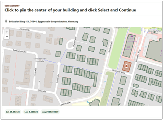
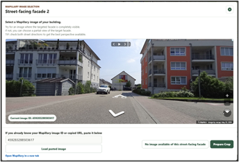
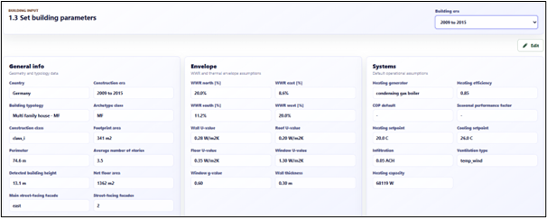
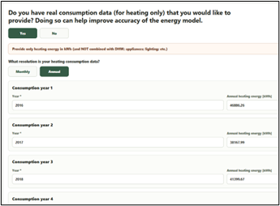

# De-Risking Tool

!!! abstract "Abstract"

    The De-risking Tool is a web-based application for a user to input their building address, automatically capture geometric data, run calibrated building energy simulations in the baseline and retrofit conditions, and evaluate savings in energy and CO2 emissions, retrofit costs, and financial metrics associated with the investment scenarios.

    The workflow combines:

    - OpenStreetMap geometry extraction.
    - Mapillary street-view imagery.
    - Deep learning detection for window-to-wall ratio (WWR), number of stories, and building height.
    - Building parameters extracted from appropriate archetypes.
    - Weather-data-driven simulation.
    - Optional calibration using real heating consumption data.
    - Selection of energy conservation measures (ECMs) and retrofit simulation.
    - Results analysis in terms of energy and CO2 savings, retrofit costs, and financial metrics.

    The tool supports early-stage retrofit assessment workflows for Germany and Italy and is intended for energy consultants, public agencies, researchers, building owners, and portfolio managers.

## Technical De-risking

Technical de-risking focuses on reducing uncertainty in the building energy model by automatically collecting, enriching, and validating building information using open-source data and user inputs.

### Workflow

The current workflow includes:

1. Load 2D geometry from OpenStreetMap. 
    <figure markdown="span">
    { width="600" }
    <figcaption>"2D Geometry from OpenStreetMap"</figcaption>
    </figure>
 
2. Load street-view imagery from Mapillary.
    <figure markdown="span">
    { width="600" }
    <figcaption>"Street-view imagery from Mapillary"</figcaption>
    </figure>
 
3. Detect window-to-wall ratio (WWR), number of stories, and building height using deep learning.
   
 
4. Load additional building parameters from archetypes.
    <figure markdown="span">
    { width="600" }
    <figcaption>"Load building parameters from archetypes"</figcaption>
    </figure>
 
5. Use real consumption data to calibrate the model.
    <figure markdown="span">
    { width="600" }
    <figcaption>"Use real consumption data to calibrate the model"</figcaption>
    </figure>

This workflow reduces technical risk by first automatically quantifying the building geometry and facade characteristics. Second, confidence in the baseline energy model is improved though the calibration process. The baseline building parameters are adjusted to more closely model the measured heating consumption data under actual year weather data.

### Technical Workflow Inputs

- OpenStreetMap building footprints
- Nearby road geometry
- Mapillary street-view imagery
- TABULA archetypes
- Actual weather data
- User-provided heating consumption

### Technical Workflow Outputs

- Building geometry
- Orientation-weighted WWR values
- Building height
- Number of building stories
- Archetype-derived building parameters
- Actual-weather EPW files
- Baseline energy simulation results
- Actual versus simulated consumption comparison

---

## Financial De-risking

The De-risking Tool converts simulation outputs into retrofit investment decision-support metrics.

The current financial analysis scope focuses on:

- Life cycle costing (LCC) of baseline and retrofit scenarios
- Sensitivity analysis for energy prices and discount rates
- Modelling of debt financing and variable interest rates
- Quantification of avoided CO2 costs under rising ETS carbon-price assumptions

### Life Cycle Costing

The tool compares baseline and retrofit scenarios over the analysis period using:

- Retrofit investment cost
- Annual energy costs
- Discounted cashflows
- Operating-cost assumptions

Outputs include:

- Net present value (NPV)
- Internal rate of return (IRR)
- Discounted payback period
- Lifecycle cost comparison

### Sensitivity Analysis

Sensitivity analysis helps evaluate retrofit robustness under uncertain future economic conditions.

Current analysis includes:

- Energy-price variation
- Discount-rate variation

Outputs include comparative scenario charts and financial-metric variation across assumptions.

### Debt Financing

The workflow allows users to evaluate retrofit scenarios under different financing assumptions.

Current capabilities include:

- Debt-financing percentage
- Loan duration
- Variable interest-rate assumptions

Outputs include financed cashflow estimates and financing-adjusted payback periods.

### CO2 Cost Analysis

The workflow estimates avoided carbon costs resulting from retrofit measures under rising CO2 price assumptions.

Current capabilities include:

- Operational emissions estimation
- Avoided-emissions comparison
- Escalating ETS carbon-price scenarios

Outputs include estimated avoided CO2 costs over the analysis period.

---

## System Architecture

### Frontend

The frontend is a React application centered on `ModerateApp.jsx`.

Responsibilities include:

- Workflow orchestration
- Map visualization
- Parameter editing
- Consumption-data entry
- Comparison charting

### Backend

The backend exposes FastAPI routes for:

- Geometry processing
- Archetype resolution
- Weather-file generation
- Baseline simulation
- WWR detection
- Mapillary image preparation

### Python Package

The `src/moderate_derisking` package contains reusable logic for:

- Geometry analysis
- Archetypes
- Weather workflows
- EPW generation
- Building simulation
- Rectification and WWR detection

---

## Intended Users

- Energy consultants
- Public-sector renovation programs
- Researchers
- Building owners
- Portfolio managers
