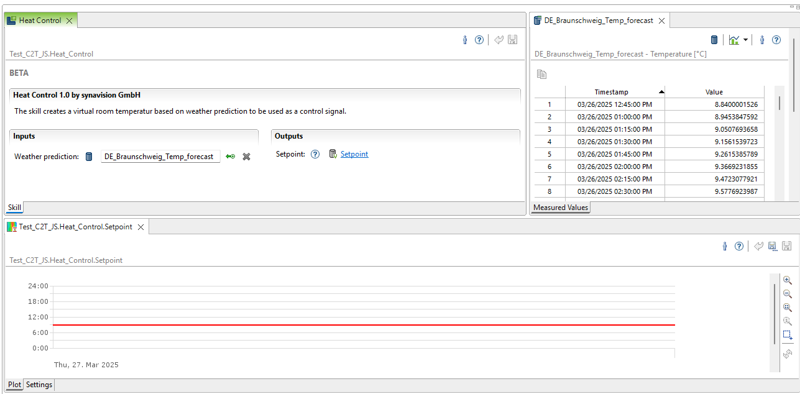

# Energy system optimization

!!! abstract "Abstract"

  This tool is a software application that, exploiting synergies within MODERATE and SYNAVISION platform, offers a customizable environment for setting up time series data analytics for energy system optimization.

## Introduction

New building frontiers are taking hold. Increasingly complex systems require greater controls. IoT is becoming an essential element to ensure that the potential of the building defined in the design phase is respected. Continuous commissioning is fundamental to optimize buildings in order to identify the right set-up that guarantees the best level of comfort at the lowest cost.

This tool enables the user to control the heating requirement in dependency of a weather forecast. This enables targeted control of the room air temperature so that the user does not have to worry about it. If the weather forecast indicates that a certain temperature limit will be exceeded over the next few days, the room temperature setpoint is lowered as a precaution, thus minimizing the heating requirement.

## User Guide

The tool is divided into several parts. An IO service must be created in the SYNAVISON platform:

This enables the import of current weather data for a selected location. From this, the outside air temperature is used as input for the “Heat Control” skill in the synavision platform. As a result, this skill outputs a time series that corresponds to the suggested room setpoint temperature.

This virtual setpoint calculated by the skill is published via MQTT in proprietary MyGekko format by the SYNAVISION platform and picked up by MyGekko influencing the room control.

### Input / Output

The skill asks for the following input and parameters:

  - Numerical timeseries ambient air temperature
  
The following Output data is provided by the skill and available to MODERATE APIs:

  -  Numerical timeseries virtual room temperature setpoint

### User experience

In principle the skill is an application without an UI, that runs on SYNAVISION client-server application. In this case, the Digital Test Bench provides the UI functionalities, connects to SYNAVISION platform and to MODERATE APIs. The client, as shown in the screenshot, offers the easy application of the skill following these steps:

   - Enter a workspace.
   - Create an instance of an open weather import plugin to get the forcasted ambient air temperature
   - Create an instance of the skill "Heat Control" by double clicking, naming and saving the instance.
   - Choose the ambient air temperature times series you want to use for control by drag and drop.
   - Save the skill.
   - Create an instance of an proprietary My Gekko Control IO service to pulbish the setpoint commands in MyGekko JSON format to the respective topics via an export job. (Work in progress. The IO-Service will be developed by synavision soon)

### Application on MODERATE

Within MODERATE, this service can be used to reduce the heat requirement by calculating a virtual room setpoint temperature depending on the predicted outside air temperature. This virtual room setpoint temperature is sent to the building automation system via MQTT so that the setpoint temperature of the room is lowered there.
