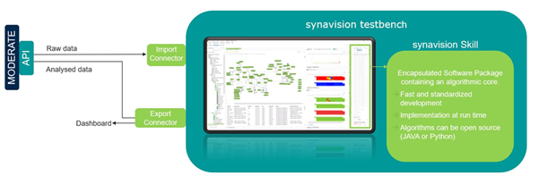

# Fault detection and forecasting

!!! abstract "Abstract"

    This tool is a software application that, exploiting synergies within MODERATE and SYNAVISION platform, offers a customizable environment for setting up time series data analytics for fault detection and       forecasting for optimization of operations, thus enabling predictive maintenance on technical building systems.

## Introduction

An effective and efficient monitoring and control system is essential for service providers such as utility companies and ESCOs as well as facility managers. The goal of continuous service without failures is only achievable through a continuous evaluation and diagnosis of the data flow of the monitored system. Fault detection is based on mathematical models of signals and processes. Its application avoids the interruption of processes in buildings systems, and particularly effective when associating the detection with predictive maintenance. 
This tool enables intelligent monitoring and supervision systems, where the fault is identified in near-real time, and positively contribute to building smartness and energy efficiency. The tool allows users, in particular energy managers and utility managers, to predict and explain system failures based on an improved knowledge of building characteristics and behaviour from MODERATE.
The tool relies on core functionalities and services available from the SYNAVISION platform (SYNAVISION.de), which offers a digital test bench for smart buildings based on digital twin models. All skills and described services can connect with the SYNAVISION platform via APIs and other data import and export services, which are already operational and validated.

## User Guide

The tool, a so called skill within SYNAVISION platform, can connect with the MODERATE platform APIs, supporting interoperability with other tools and functionalities. It supports additional data I/O, as specific near real-time data handling. While import handles time series and metadata, exports can include various formats such as dashboards, files etc. for reporting KPIs to the users.

<figure markdown="span">
  { width="800" }
  <figcaption>Interconnection between MODERATE platform and SYNAVISION platform.</figcaption>
</figure>

A skill is defined as an application within the context of SYNAVISION platform, and in particular within SYNAVISION’s test bench client-side software for digital twinning. It can import times series data and metadata, handle the data logically and arithmetically and export results. The skill is executed whenever new data is imported into corresponding workspace of the platform. 

<figure markdown="span">
  { width="800" }
  <figcaption>Skill-concept for analytics services of time series data.</figcaption>
</figure>

Besides the skill engine, the SYNAVISION platform allows for a highly flexible domain-specific language (sand-box model) for additional, individual data handling. 

There have been developed two different skills for the aim of fault detection (1) and for forecasting (2).

The skill for anomaly detection (Anomaly Detection Skill) identifies anomalies in time series and can therefore be used for fault detection purposes. Various algorithms for anomaly detection can be selected by the user. In addition, meaningful metrics are generated, which provide an overview of the general state as well as the recent historical data points regarding occurring anomalies.

The skill for forcasting (Forecasting Timeseries Skill) can be used to for prediction of timeseries data. In particular, this skill can generate a time series dataset for a selected period of time in the future based on at least three weeks of historical data (the minimum useful range to generate acceptable results, found empirically) and additional information from MODERATE knowledge. Various algorithms for prediction are available to the user. In addition, meaningful KPIs are generated providing additional information on the data used and the information generated.

### Input / Output
#### Anomaly Detection Skill
The skill asks for the following input and parameters:
- Numerical time series of which a subrange is to be checked for anomalies, including user data as well as time series datasets passed by MODERATE APIs, i.e., from other MODERATE services. The skill can handle any kind of data, i.e., energy metering, mass flow rate, electric current, IEQ monitoring. The type of algorithm, time range and other variables need to be adapted for best performance.
- Size of the time window to be checked for anomalies (test interval). The specification is made in time steps according to the data point quantization. For example, to test the last day of the time series or the last 96 timesteps of the time series for anomalies at a quarter-hour resolution, a time window size of 96 must be specified).
- Size of the time window in number of time steps according to the data point quantization to be used for learning the normal process (training interval).
- Selection of the concrete algorithm to be used to detect the anomalies:
  - Auto Regression
  - Generalized ESD Test
  - Inter Quartile Range
  - Rolling Average
  - Principal Component Analysis.

The algorithmic options provided here have been identified as useful and robust options for generic anomaly detection and shall be applied depending on the type and characteristics of the time series data. The selection of the algorithm needs to be done by an expert depending on individual types of data.

<figure markdown="span">
  { width="800" }
  <figcaption>Setup menu for the configuration of the skill within the SYNAVISION platform.</figcaption>
</figure>

#### Forecasting Timeseries Skill

The skill asks for the following input:
- Numerical time series containing the historical data.
- Size of the time window for which the time series shall be predicted.
- Size of the time window used as training data.
- Selection of the concrete algorithm to be used to predict the future behaviour:
  - Holt Winters Additive Trend Additive Season
  - Holt Winters Additive Trend Multiplicative Season
  - Neural Basis expansion analysis
  - Trigonometric seasonality, Trend and Season
  - Trigonometric seasonality, Trend Box-Cox, Trend
  - Trigonometric seasonality, Trend Box-Cox, Trend and Season
  - Trigonometric seasonality, Trend Box-Cox, Trend and 2 Season

As output, the skill delivers:
- a forecasted time series

and as indicators for the quality of the prediction 
- the Root Mean Squared Error
- the Mean Squared Error
- the Mean Absolute Error.

### User experience

In principle the skill is an application without an UI, that runs on SYNAVISION client-server application. In this case, the Digital Test Bench provides the UI functionalities, connects to SYNAVISION platform and to MODERATE APIs. 

#### Anomaly Detection Skill
The client, as shown in the screenshot, offers the easy application of the skill following these steps:

<figure markdown="span">
  { width="800" }
  <figcaption>Configuration menu of the anomaly detection skill.</figcaption>
</figure>

Steps:
-	Enter a workspace.
-	Create an instance of the skill by double clicking, naming and saving the instance.
-	Choose the times series you want to analyse by drag and drop.
-	Enter the length of testing and training period (number of time steps)
-	Choose the algorithm to be applied.
-	Save the skill.

The following screenshot shows a time series (below) and the anomalies detected through a principal component analysis.

<figure markdown="span">
  { width="800" }
  <figcaption>Visualization of the skill output (example, anomalies marked gradually in lower plot and in red in top plot).</figcaption>
</figure>

#### Forecasting Timeseries Skill

The client, as shown in the screenshot, offers the easy application of the skill following these steps:

<figure markdown="span">
  { width="800" }
  <figcaption>Configuration menu of the forcasting skill.</figcaption>
</figure>

Steps:
-	Enter a workspace.
-	Create an instance of the skill by double clicking, naming and saving the instance.
-	Choose the times series you want to analyse by drag and drop.
-	Enter the length of testing and training period (number of time steps)
-	Choose the algorithm to be applied.
-	Save the skill.

The following screenshot shows the time series (blue) and the predicted times series for the next day (green).

<figure markdown="span">
  { width="800" }
  <figcaption>Visualization (example) of an initial time series (blue) and the prediction for the following day (green).</figcaption>
</figure>

### Application on MODERATE

#### Anomaly Detection Skill
Within MODERATE, this service can be used to identify anomalies in any time series, e.g., weather data, metering data etc. Extended with an auto-correction skill for data enhancement, e.g., for deleting and replacing values, the tool can be used as a powerful “behind-the-scenes”-tool to improve data quality and performance of other services within the MODERATE platform.

#### Forecasting Timeseries Skill
Time series prediction can be used to model the future behaviour of a system, e.g., the energy consumption of a building. Knowing the future energy consumption can help to manage energy demand by optimizing the management of storage capacities, e.g., through load shifting or peak shaving. By knowing when a load peak is likely, when energy prices are high (or low) or demand is going to be low (or high), the building management system can decide to increase or reduce the amount of stored energy in buffer tanks or construction and thus avoid reaching peaks or buying energy at high cost. 

## References
- https://de.documentation.synavision.de/specification/skill/
- https://lib.synavision.de/produkt-kategorie/skills/
