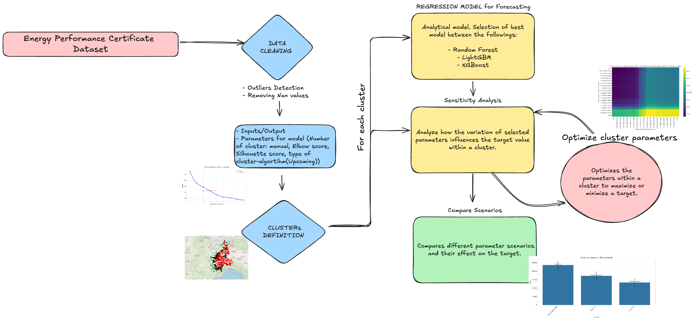
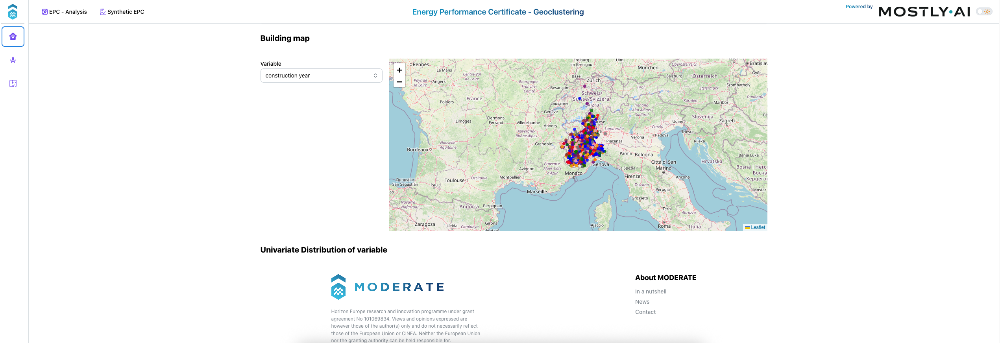
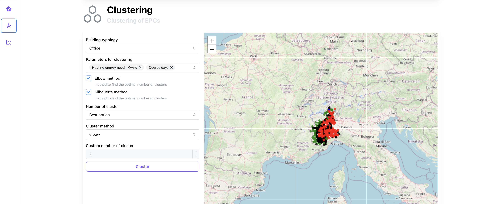
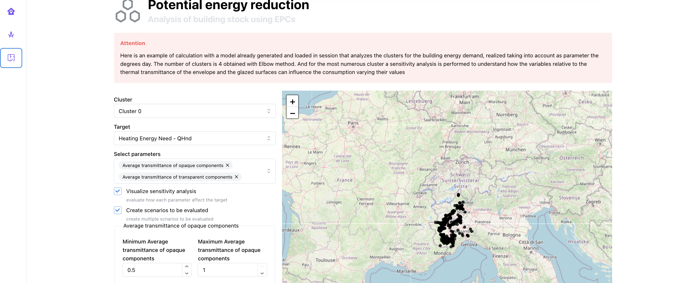
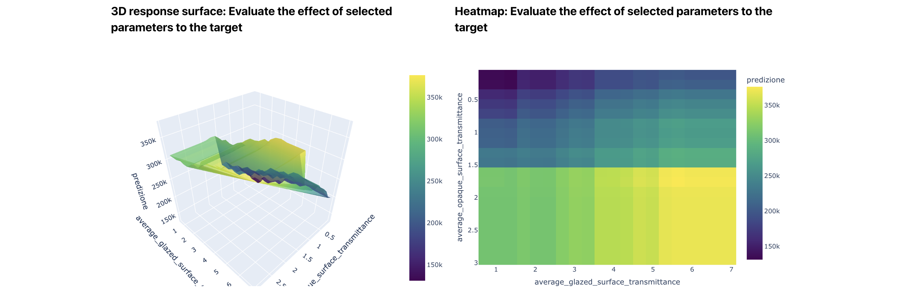
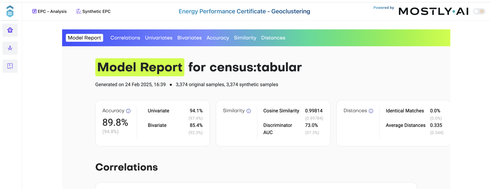

# Geoclustering Tool

!!! abstract "Abstract"

    The geoclustering tool is designed to cluster buildings based on their geospatial location and other relevant features. This tool can be used to identify patterns and relationships between buildings, and to better understand the distribution of buildings in a given area.
    Moreover, the tool allows to perform a sensitivity analysis to evaluate the impact of different clustering parameters on the results. An example of this analysis is the evaluation of different scenarios to study the impact of the trasmittance of the envelope on the energy need of the buildings.

## Introduction

The geoclustering tool is a web-based platform that enables users to cluster buildings based on different features, including geospatial location and other relevant information. The tool is built using Python and is designed to be easy to use and understand. 
The user can visualize the characteristics of the EPC dataset, filter them according to specifici physical features, and perform a geoclustering analysis. 
The resulting clusters are visualized in a dedicated map.

Subsequently, the user can perform a sensitivity analysis to evaluate the impact of different clustering parameters on the results. 

The engine of the tool is availble here: 
https://github.com/MODERATE-Project/geoclustering_sensitivity_analysis

The user can use the web app or perform a directly analysis using the dedicated repository.

## Workflow

<figure markdown="span">
  { width="800" }
  <figcaption>Geoclustering workflow</figcaption>
</figure>

## User Guide

The tool is composed of two main sections, accessible through the navbar in the header. These sections include two main categories:

https://tools.eeb.eurac.edu/epc_clustering/piemonte/

### EPC - Analysis

Users can view the EPC dataset, filter it according to specifici physical features, and perform a geoclustering analysis.

<figure markdown="span">
  { width="800" }
  <figcaption>EPC dataset</figcaption>
</figure>

<figure markdown="span">
  { width="800" }
  <figcaption>Clustering</figcaption>
</figure>

<figure markdown="span">
  { width="800" }
  <figcaption>Potential energy reduction</figcaption>
</figure>

<figure markdown="span">
  { width="800" }
  <figcaption>Scenarios</figcaption>
</figure>

### Synthetic dataset

In this section, users can visualize the synthetic dataset of the EPCs.

<figure markdown="span">
  { width="800" }
  <figcaption>Synthetic report of EPC </figcaption>
</figure>

