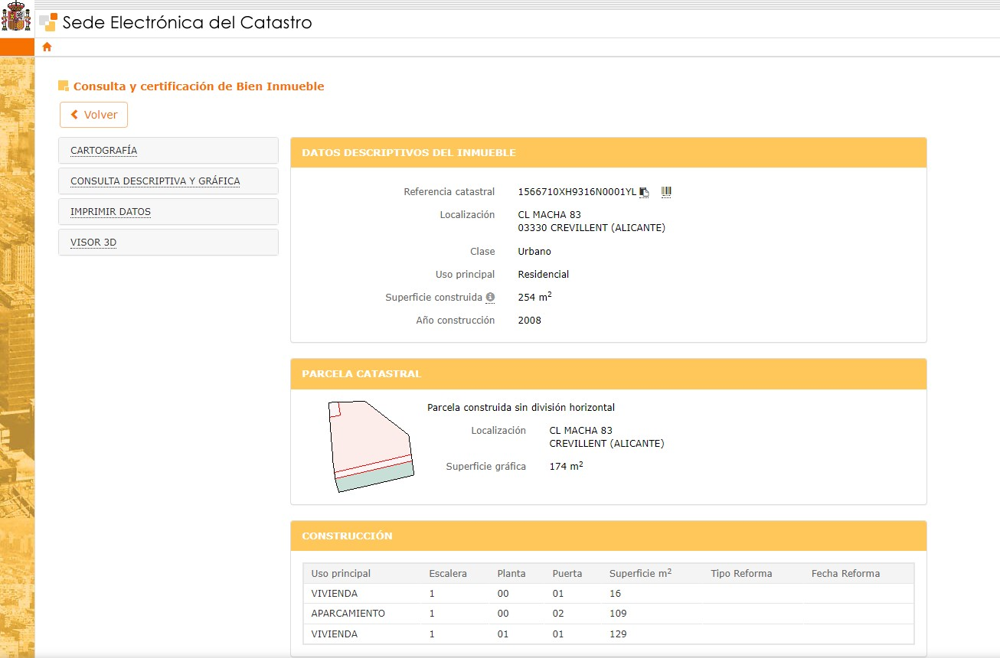
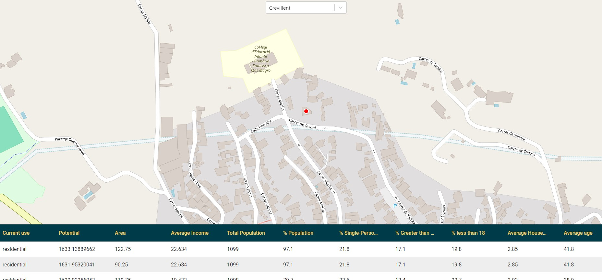
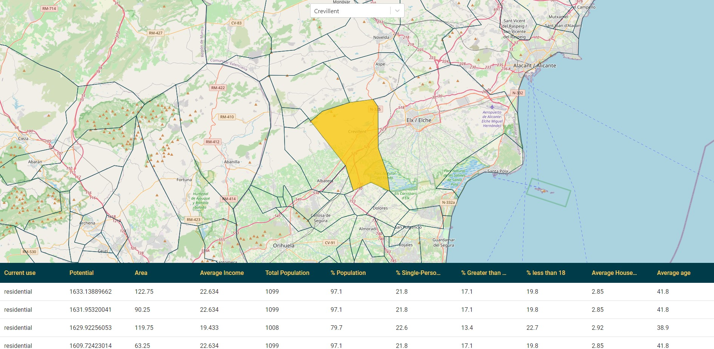

# Local energy communities assessment tool

!!! abstract "Abstract"

    What is this tool for? What are the most interesting features?

## Introduction

> Provide more context about the background of this tool or service. What problem is it trying to solve? How does it contribute to the ecosystem? Why should a user invest time in learning about this tool or service, and what benefits do they gain from using it?

A Local Energy Community (LEC) is a legal entity where various actors collaborate to meet their energy needs through shared production, transmission, and consumption. LECs play a pivotal role in the transition towards decarbonizing buildings, promoting social interaction, and integrating renewable energy sources. However, one of the main challenges in establishing a successful LEC is identifying the geographic areas where these communities can thrive. This is where the tool comes into play.

The tool is designed to solve the complex problem of determining suitable areas for LECs by analyzing diverse datasets, such as energy consumption, cadastral information, and infrastructure details. Using machine learning techniques, it processes this information to provide actionable insights that help users define areas where LECs can be effectively implemented.

By enabling the creation of LECs, the tool contributes to a more sustainable energy ecosystem, supporting decarbonization efforts and the wider adoption of renewable energy. It helps streamline energy management, making energy production and consumption more efficient within communities. Users who invest time in learning and using this tool gain the ability to identify optimal locations for LECs, contributing to environmental sustainability and community engagement, while simplifying a typically complex and data-intensive process.

## User Guide

This section explains how the tool or service is used from an end-user perspective. What should the user take into account when running the tool? Are there any prerequisites, such as dependency installation or registration? If the tool requires datasets as input, specify the requirements for these datasets, including the expected data format, column types, and any other relevant details.

<figure markdown="span">
  { width="800" }
  <figcaption>Building cadaster data</figcaption>
</figure>

<figure markdown="span">
  { width="800" }
  <figcaption>Selecting a building</figcaption>
</figure>

<figure markdown="span">
  { width="800" }
  <figcaption>Selecting a municipality</figcaption>
</figure>

!!! info "Known limitations and issues"

    Be sure to mention any known limitations of the tool or service (if applicable), as well as any issues that are known and will be addressed in the future.

## References

Useful links and additional references.
