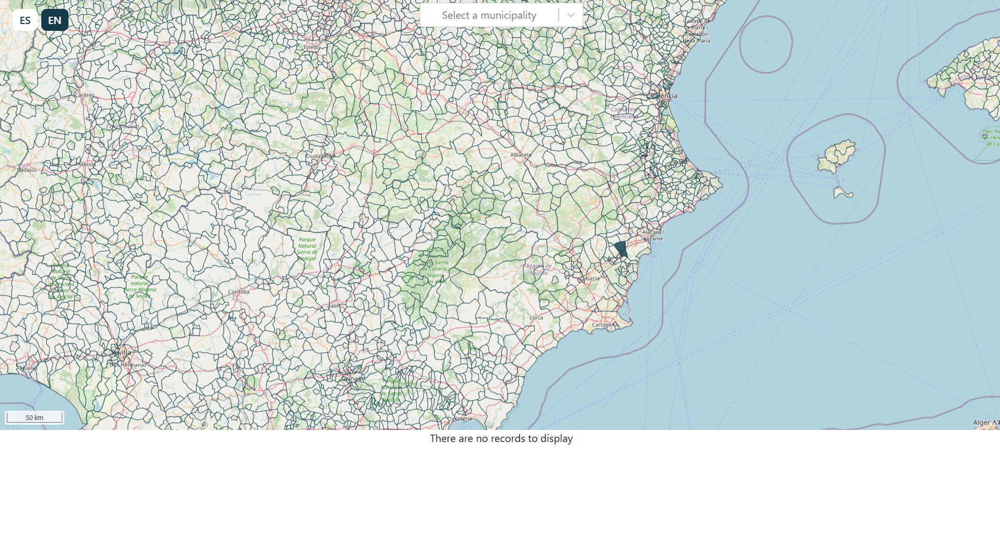
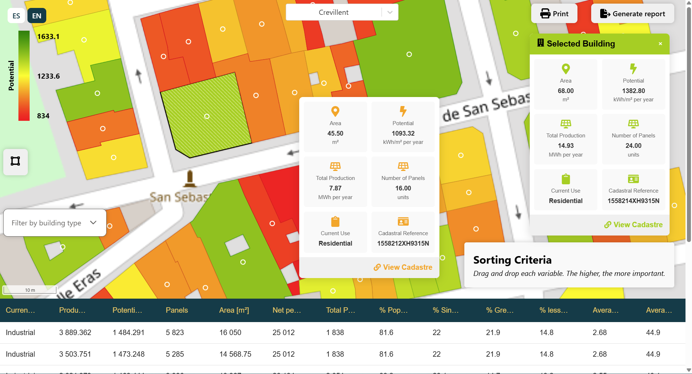
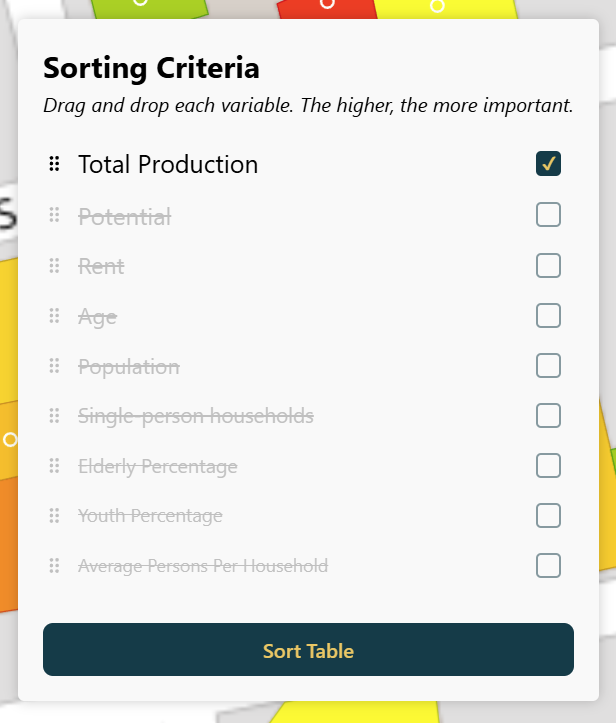

# Local Energy Communities Assessment Tool

!!! abstract "Abstract"

    What is this tool for? What are the most interesting features?

## Introduction

> Provide more context about the background of this tool or service. What problem is it trying to solve? How does it contribute to the ecosystem? Why should a user invest time in learning about this tool or service, and what benefits do they gain from using it?

A Local Energy Community (LEC) is a legal entity where various actors collaborate to meet their energy needs through shared production, transmission, and consumption. LECs play a pivotal role in the transition toward decarbonizing buildings, promoting social interaction, and integrating renewable energy sources. However, one of the main challenges in establishing a successful LEC is identifying the geographic areas where these communities can thrive. This is where the tool comes into play.

The tool is designed to solve the complex problem of determining suitable areas for LECs by analyzing diverse datasets, such as energy consumption, cadastral information, and infrastructure details. Using machine learning techniques, it processes this information to provide actionable insights that help users define areas where LECs can be effectively implemented.

By enabling the creation of LECs, the tool contributes to a more sustainable energy ecosystem, supporting decarbonization efforts and the wider adoption of renewable energy. It helps streamline energy management, making energy production and consumption more efficient within communities. Users who invest time in learning and using this tool gain the ability to identify optimal locations for LECs, contributing to environmental sustainability and community engagement, while simplifying a typically complex and data-intensive process.

The tool is currently accessible at the following URL: [https://lec.moderate.cloud/](https://lec.moderate.cloud/)

## User Guide

> This section explains how the tool or service is used from an end-user perspective. What should the user take into account when running the tool? Are there any prerequisites, such as dependency installation or registration? If the tool requires datasets as input, specify the requirements for these datasets, including the expected data format, column types, and any other relevant details.

The main view of the web app shows a map of a country, currently Spain, with all its municipalities. The user can select any municipality to center the screen for close examination. However, only those municipalities with a blue background contain building data.

<figure markdown="span">
  { width="800" }
  <figcaption>First look of the tool. Each polygon represents a municipality in Spain.</figcaption>
</figure>

!!! warning "Currently, only the municipality of Crevillent contains building data."

When focused on a municipality that contains data, the bottom of the screen displays a table with the first 10 buildings ranked by solar potential radiation. This is the default sorting criterion, but the user can change it in two ways, which will be explained in the next sections.

<figure markdown="span">
  { width="800" }
  <figcaption>Selecting a municipality. Notice that additional buttons appear, and the table at the bottom contains data.</figcaption>
</figure>

The main functionalities of the tool are:

- Viewing building data in a table format and manipulating its sorting criteria.
- Viewing building data on a map, with colors representing potential solar radiation. This also provides access to cadastral information.
- Filtering buildings by drawing a polygon box on the map.
- Saving or printing a document containing the current state of both the table data and the map view.
- Generating a personalized report that provides an overview of the municipality and a detailed analysis of the selected buildings.

In the following sections, we describe in detail how the user can achieve these actions.

### The Map View

As mentioned before, the user can select any municipality on the map. If the selected municipality contains building data, the interface will show additional buttons and gradient colors, as shown in the image below.

<figure markdown="span">
  { width="800" }
  <figcaption>Zooming in, a color gradient on the map indicates the relative solar potential of the buildings.</figcaption>
</figure>

The user can click on a row in the table to center the view on a specific building, or navigate the map and click on it directly. The selected building will display a diagonal hatch pattern to indicate its location, and a popover on the right side will provide detailed building information and a button to redirect the user to the building's page within the official cadastral website.

<figure markdown="span">
  { width="800" }
  <figcaption>Building cadaster data</figcaption>
</figure>

Additionally, if the user zooms in enough, the centroids of the buildings will appear. This activates the comparison mode, where the user can hover over any building to see its information.

The following image illustrates these functionalities:

<figure markdown="span">
  { width="800" }
  <figcaption>Analyzing buildings and their solar potential</figcaption>
</figure>

### Changing Sorting Criteria

As mentioned before, the default sorting is by solar potential radiation. The user can change the order of the table by clicking on the column headers. For more complex sorting, the user can click the "Sorting criteria" box to unfold the advanced sorting options.

Inside this panel, the user can drag each variable to the desired position. The order of the variables determines the importance. Thus, each variable is given a weight, and the buildings will be sorted by the weighted sum of the variables.

<figure markdown="span">
  { width="460" }
  <figcaption>Sorting criteria panel, located at the bottom right of the screen</figcaption>
</figure>

After the sorting criteria are defined, the user can click the button to apply the new sorting to the table below.

### Filtering Buildings

One of the key features of the tool is the filtering of buildings. From all the available buildings, the user can select a subset by using the draw mode.

To change the tool’s mode, the user can click on the { width="35" } button, located on the left side of the screen.

With this mode selected, the pointer changes to a blue dot, and some view functionalities will be disabled. The user can then click to add several points to form a desired polygon. When the user clicks on the first point again, or double-clicks, the polygon will close, and the tool will filter and display only the buildings inside the polygon.

Consequently, the table will also display only the buildings within the polygon, ensuring consistency between both views.

<figure markdown="span">
  { width="800" }
  <figcaption>Filtering a block of buildings by drawing a polygon over them.</figcaption>
</figure>

To exit the drawing mode, the user can click the draw button again. A button at the bottom of the map allows the user to reset the filter and display all buildings again.

### Report Generation

The tool allows users to generate a report detailing the characteristics of the buildings, along with additional data and a brief analysis of the selected municipality and the filtered buildings.

To generate the report and save it to their computer, users can click the "Generate report" button. In a few seconds, the report will be generated and downloaded locally.

!!! info "About the report generation"

    This feature is still under development, so the generated report is not yet fully complete.

## References

- Access to the tool: [https://lec.moderate.cloud/](https://lec.moderate.cloud/)

- Spanish cadastre website: [https://www.sedecatastro.gob.es](https://www.sedecatastro.gob.es)
