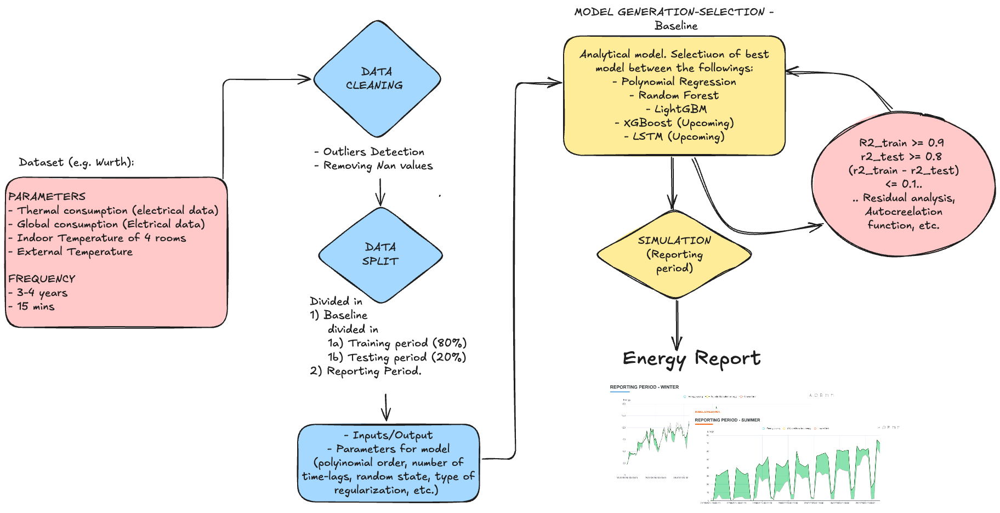

# Measurement and Verification Tool

!!! abstract "Abstract"

    The Measurement and Verification Tool is a web application that allows users to perform measurement and verification of building energy performance, using the option C of the International Performance Measurement and Verification Protocol (IPMVP).
    

The Measurement and Verification Tool is a web application that allows users to perform measurement and verification of building energy performance, using the option C of the International Performance Measurement and Verification Protocol (IPMVP).

The Option C measures the total energy consumption of a building or plant before and after an energy efficiency intervention, to calculate the total savings obtained.

It uses the real measurement of the consumption (e.g. from electricity meters, gas, etc.).

It builds a statistical baseline model (typically regression) based on historical data and independent variables such as:

- External temperature
- Working days
- Occupation hours

It compares the predicted consumption (baseline) with the actual consumption after the intervention, normalizing for conditions.

## Workflow

<figure markdown="span">
  { width="800" }
  <figcaption>Measurement and Verification Tool workflow</figcaption>
</figure>

## User Guide

The tool use the engine developed in the repository:
https://github.com/MODERATE-Project/Measurement-and-verification

the resulting report is intgerated in the benchmarking web tool: 
https://tools.eeb.eurac.edu/building_benchmarking/ 

in the dedicated section: Measurement and Verification

## Report

The resulting report has the following shape:

[Example report](../imgs/me-v-tool/measurement_and_verification_report.html)

