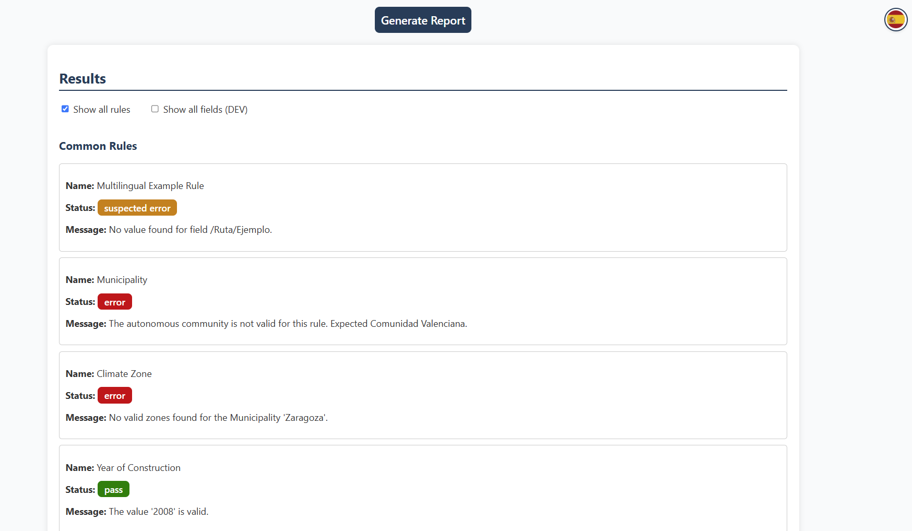

# Quality Check Report Tool

!!! abstract "Abstract"

    MODERATE Quality Check Report Tool is a web-based application designed to validate and analyze Energy Performance Certificates (EPC) in XML format. This tool automates the process of identifying inconsistencies and discrepancies in EPCs by applying a set of predefined validation rules. The application provides immediate feedback through a user-friendly interface, helping users ensure their certificates meet all required standards and specifications.

## Introduction

The MODERATE Quality Check Report Tool was developed to address the need for automated validation of Energy Performance Certificates. By providing instant analysis and detailed feedback, it helps users identify and correct issues in their EPCs before submission, reducing errors and improving the overall quality of energy certification processes.

The tool is particularly useful for professionals in the energy sector, including energy auditors, building managers, and regulatory bodies, who require a reliable method to ensure compliance with energy performance standards.

The tool is currently accessible at the following URL: [http://moderated.five.es:55000](http://moderated.five.es:55000/)

## User Guide

The MODERATE Quality Check Report Tool provides a straightforward process for validating your Energy Performance Certificates. The application is designed to be intuitive and user-friendly, requiring minimal technical knowledge to operate effectively.

To begin using the tool, simply drag and drop your EPC XML file onto the designated area of the interface. The system will automatically process the file and begin the validation process. If the certificate requires additional information, the application will present a series of questions that need to be answered to complete the validation.

Once the validation is complete, you'll be presented with a comprehensive view of the validation results. By default, the interface shows only the rules that have been violated. However, you can easily toggle to view all validation rules, including those that have passed and failed, by using the filter options available in the interface.

The validation results are presented in a clear, organized manner, showing:

- The specific rules that were checked
- The status of each validation (passed/failed)
- Detailed information about any issues found
- The location of problems within your certificate

<figure markdown="span">
  { width="800" }
  <figcaption>First view of the app. Note the draggable section on the center of the screen</figcaption>
</figure>

### EPC validation rules

The tool applies a set of predefined validation rules to the EPC XML file. These rules are designed to ensure that the certificate meets all required standards and specifications. The rules are organized into categories, each with its own set of criteria.

- **Common Rules**: These rules are applied to all EPCs.
- **Model Specific Rules**: Depending on the model of the EPC, different rules are applied.

### Rules status

After each rule has been validated, the tool will provide a status for the rule. The status can be:

- **Passed**: The rule has been successfully validated.
- **Error**: The rule has not been successfully validated.
- **Suspected error**: The tool has detected an issue that requires further investigation.

## Report generation

The user can generate a report of the validation results. The report will be generated in PDF format and will contain the following information:

The user can generate a report of the validation results. To do so, the user can click on the "Generate Report" button. The report will be generated in PDF.

<figure markdown="span">
  { width="800" }
  <figcaption>Validation results example</figcaption>
</figure>

!!! info "Known limitations and issues"

    Please, consider this tool as a proof of concept. It is not yet fully functional and is still under development. Specially concurrent users may cause issues.

## References

- [Application URL](http://moderated.five.es:55000/) - Direct access to the MODERATE Quality Check Report Tool.

- [EPC Documentation](https://www.miteco.gob.es/content/dam/miteco/es/energia/files-1/Eficiencia/CertificacionEnergetica/DocumentosReconocidos/documentos-reconocidos/normativamodelosutilizacion/2-Informe_evaluacion_energetica_edificio_formato_electronicov2.1_XML.pdf) - Spanish Official EPC format documentation.

- [Example EPCs](https://github.com/MODERATE-Project/quality-check-report-tool/tree/master/epcs) - Sample valid EPC files for reference. Access is restricted to the MODERATE team.
