# Solar Cadastre Assessment Tool

!!! abstract "Abstract"

    The Solar Cadastre (SC) Assessment Tool is designed to help users calculate the energy potential of their buildings or assess the performance of their solar panels.

    The tool utilizes different profiles to analyze building data, calculate solar potential, and retrieve geospatial information. Users can interact with the map by selecting their building and performing the two available calculations.

## Introduction

A Solar Cadastre (SC) is a legal framework where various stakeholders collaborate to meet their energy needs through shared production, transmission, and consumption.

The tool is designed to analyze building data within a city, calculating solar potential using a geospatial system. It provides users with key indicators in percentage format to assess their building’s solar potential.

Additionally, users can perform a second calculation to evaluate the performance of their solar panels, determining whether they are operating efficiently.

The tool is currently accessible at: [https://lec.moderate.cloud/](https://lec.moderate.cloud/)

## User Guide

The main view of the web application allows users to select the city they want to analyze.

<figure markdown="span">
  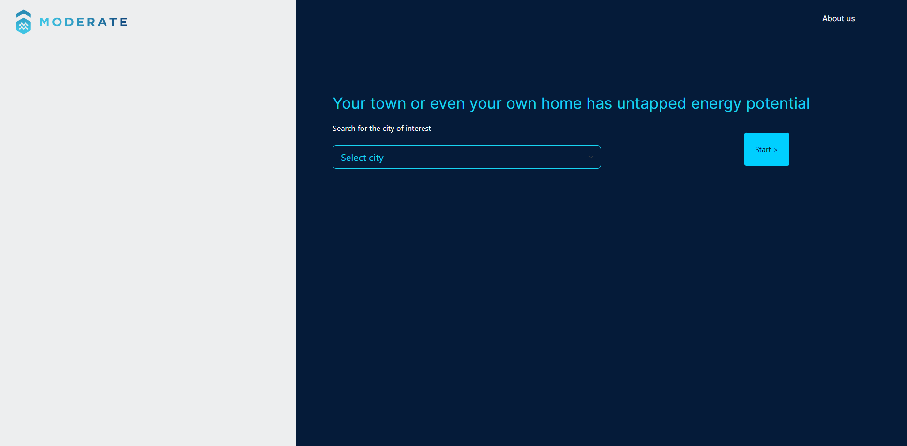{ width="800" }
  <figcaption>City selection screen. Currently, the tool supports only one city in Spain.</figcaption>
</figure>

!!! warning "Currently, only the municipality of Crevillent contains building data."

Upon selecting a city, the tool redirects users to an interactive map with various functionalities.

<figure markdown="span">
  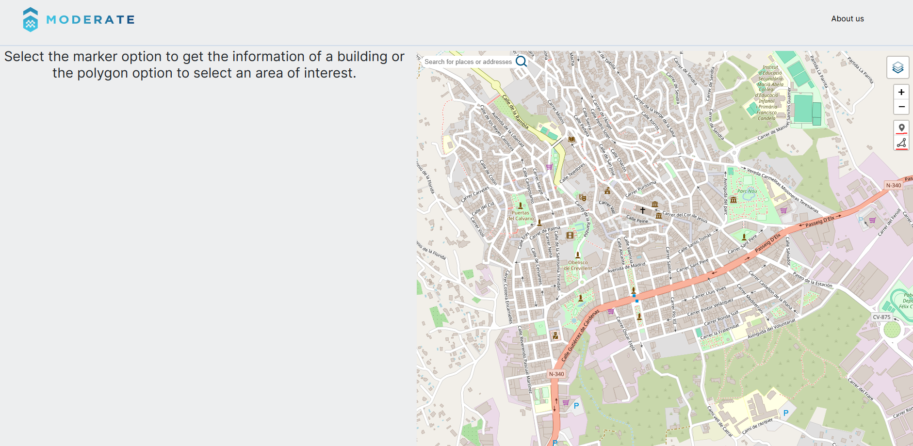{ width="800" }
  <figcaption>Map interface. Currently, only Crevillent, Spain, is available.</figcaption>
</figure>

### Key Functionalities

- View summarized data of selected buildings by drawing an area on the map.
- Retrieve building information, calculate energy potential, and assess solar performance, including cadastral details.
- Calculate the energy potential of a selected building.
- Perform a solar performance evaluation.
- Toggle different map layers, such as cadastral buildings, photovoltaic (PV) generation cells, and cadastral data.

The following sections detail how users can utilize these functionalities.

### Selecting an Area on the Map

Users can draw a polygon over the buildings on the map to obtain summarized data, including PV energy potential, nominal power, optimal PV installation, potential CO2 emission reductions, and average yield.

<figure markdown="span">
  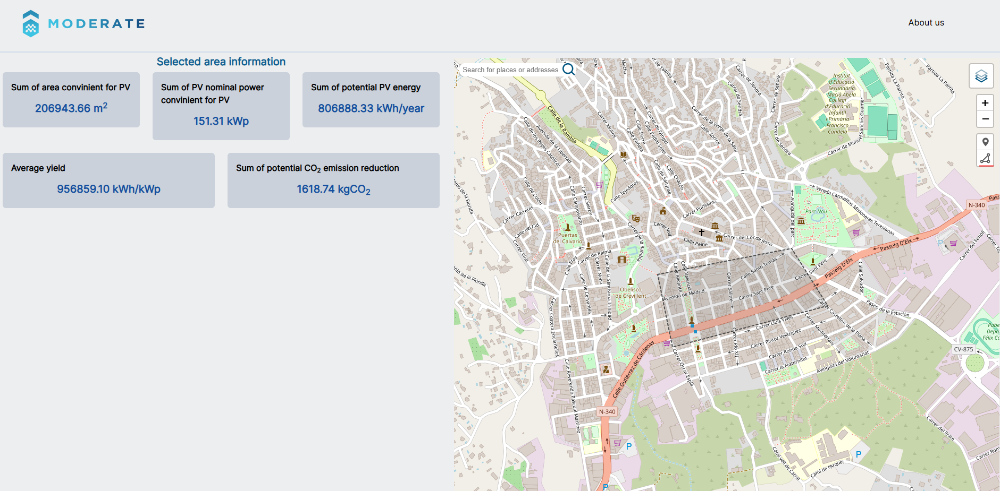{ width="800" }
  <figcaption>Drawing an area on the map.</figcaption>
</figure>

### Selecting a Building on the Map

Users can select a building using the pin tool. Once selected, detailed building data appears on the left panel, along with raster information.

<figure markdown="span">
  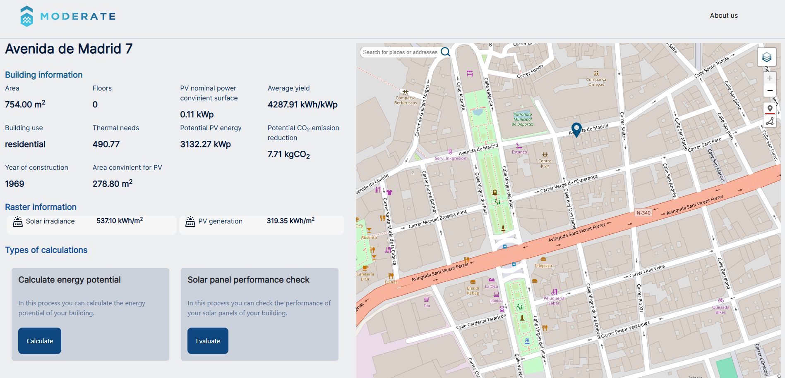{ width="800" }
  <figcaption>Building selection interface.</figcaption>
</figure>

The tool allows two processes: energy potential calculation and solar performance evaluation.

### Calculating Energy Potential

A pre-filled form appears, which users can modify if they have more accurate data for their building. Users must select a profile to ensure accurate calculations.

<figure markdown="span">
  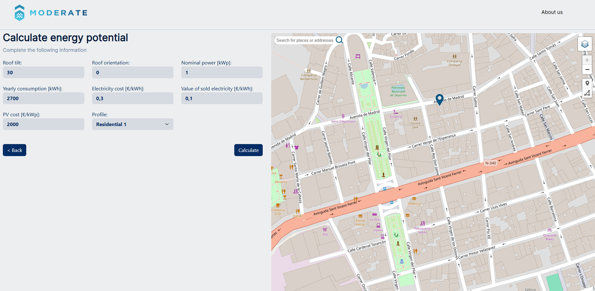{ width="800" }
  <figcaption>Energy potential calculation form.</figcaption>
</figure>

Once the profile is selected and the calculation is initiated, a "Processing" message appears, indicating the computation is in progress. This may take a few seconds to minutes.

<figure markdown="span">
  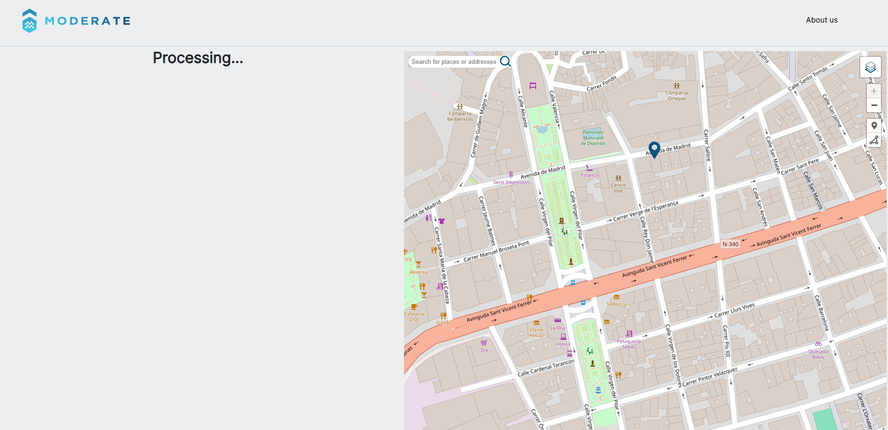{ width="800" }
  <figcaption>Processing solar potential calculation.</figcaption>
</figure>

After processing, the tool displays the results in a table and graph format.

<figure markdown="span">
  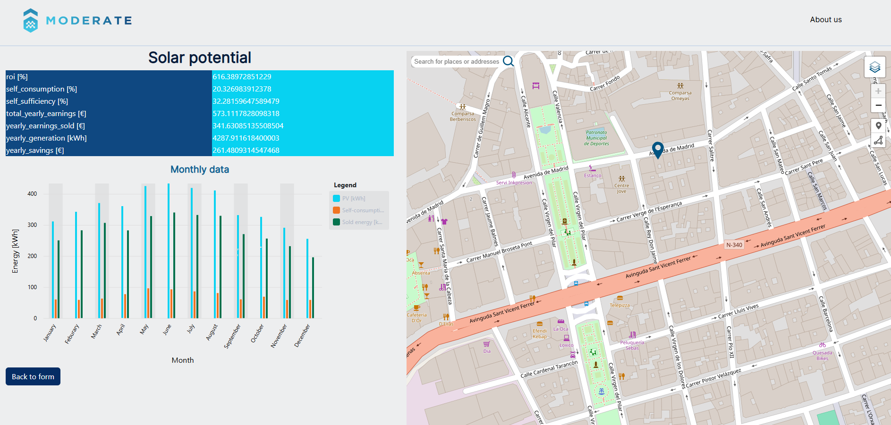{ width="800" }
  <figcaption>Solar potential calculation results.</figcaption>
</figure>

### Solar Performance Check

To return to the building data screen, users can click the back button.

To perform the second calculation, users must press the "Evaluate" button.

<figure markdown="span">
  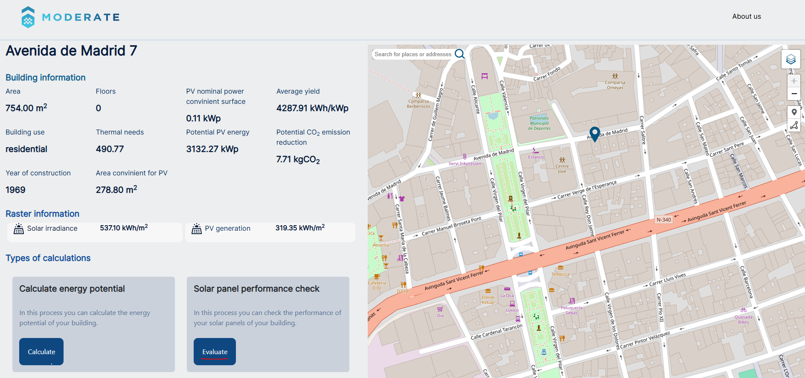{ width="800" }
  <figcaption>Solar performance evaluation.</figcaption>
</figure>

Users must enter the energy generated in the last year.

<figure markdown="span">
  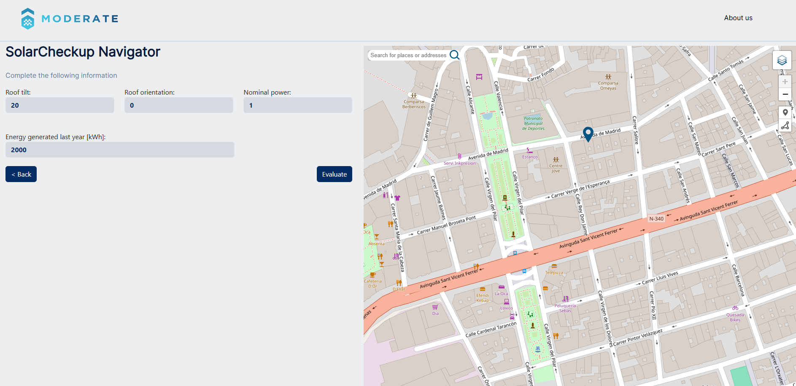{ width="800" }
  <figcaption>Solar performance evaluation form.</figcaption>
</figure>

After clicking "Evaluate," a processing message appears, and results are displayed after a few seconds.

<figure markdown="span">
  { width="800" }
  <figcaption>Processing solar performance check.</figcaption>
</figure>

Results include two graphs—one showing cumulative energy output over past years and another displaying the current year's performance.

<figure markdown="span">
  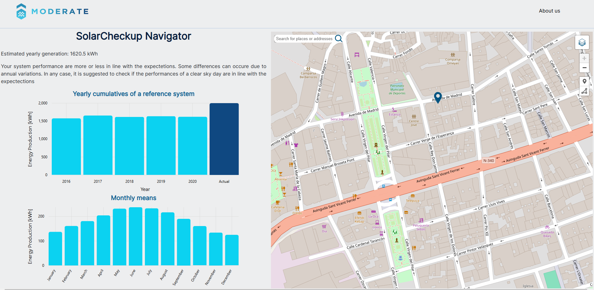{ width="800" }
  <figcaption>Solar performance results.</figcaption>
</figure>

Users can select a month from a dropdown menu to compare expected vs. actual energy output, then answer a verification question.

<figure markdown="span">
  { width="800" }
  <figcaption>Monthly performance comparison.</figcaption>
</figure>

If expected and actual outputs match, the system confirms proper functionality.

<figure markdown="span">
  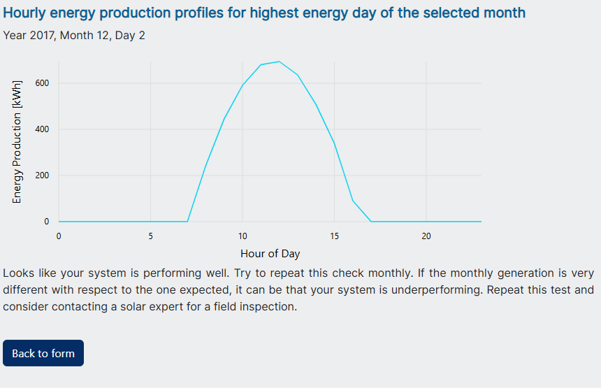{ width="800" }
  <figcaption>Confirmation of proper solar panel operation.</figcaption>
</figure>

If they do not match, users must indicate "No" and select a reason from a predefined list.

<figure markdown="span">
  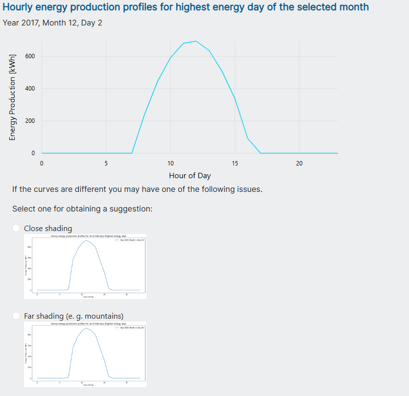{ width="800" }
  <figcaption>Selecting a reason for discrepancies.</figcaption>
</figure>

After submission, the tool displays the selected reason.

<figure markdown="span">
  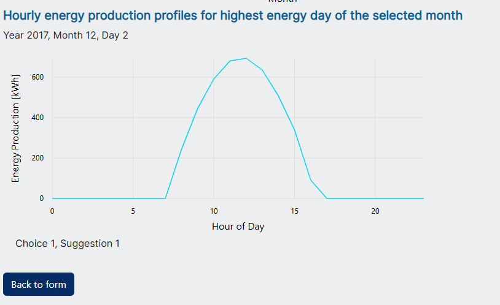{ width="800" }
  <figcaption>Final confirmation of selected reason.</figcaption>
</figure>

### Viewing Layers

Users can enable map layers by clicking the first menu option and selecting a layer, such as cadastral buildings or land registry data.

<figure markdown="span">
  { width="800" }
  <figcaption>Building cadastre layer.</figcaption>
</figure>

## References

- Access the tool: [https://lec.moderate.cloud/](https://lec.moderate.cloud/)
- Spanish cadastre website: [https://www.sedecatastro.gob.es](https://www.sedecatastro.gob.es)
